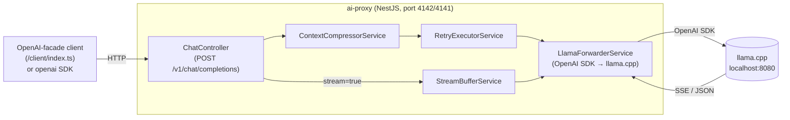
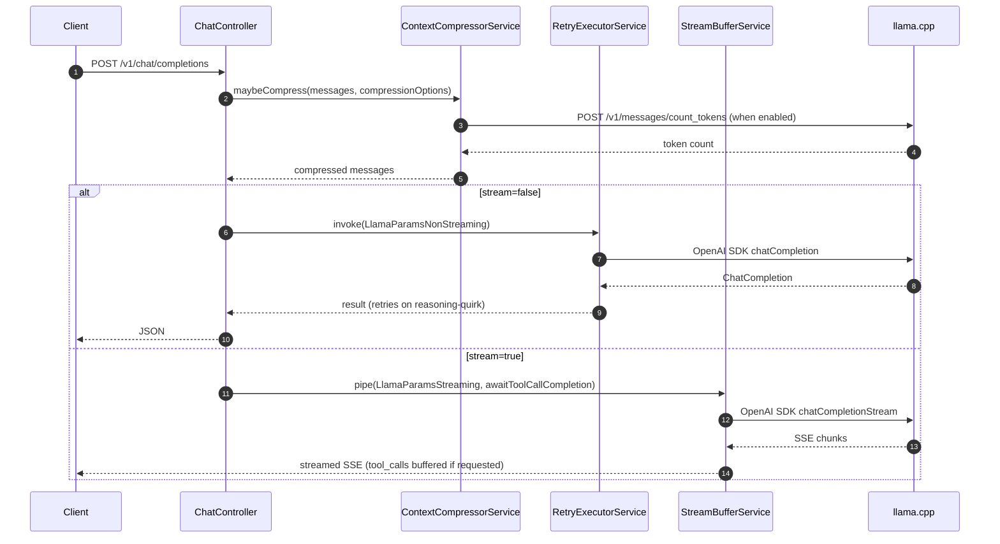
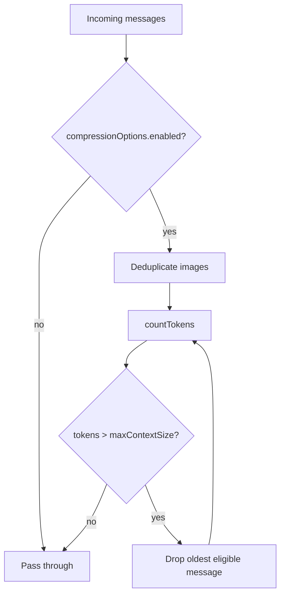
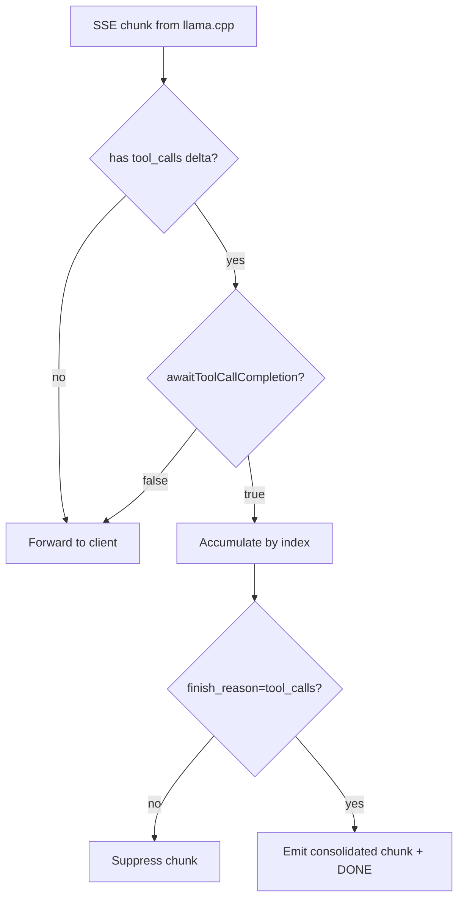

# AI Proxy

## Introduction

`ai-proxy` is an OpenAI-compatible HTTP service that fronts a local llama.cpp server (`localhost:8080`) and adds capabilities the bare server lacks: (1) **context compression** before the request is forwarded, (2) **retry with reasoning-quirk recovery** for the well-known llama.cpp behavior where a model emits only `reasoning_content` and no `content`/`tool_calls`, and (3) **server-side tool-call buffering** during streaming so clients can opt out of reassembling streamed JSON fragments.

The proxy is built with **NestJS**, uses the **OpenAI Node SDK** internally to call llama.cpp (typed, SSE-aware), emits an OpenAPI 3 spec at startup via `@nestjs/swagger`, and ships a hand-rolled OpenAI-facade client under `/client` that mirrors the official `openai` npm package interface. Downstream apps install the client via `npm install file:../ai-proxy/client` and call it identically to `openai`.

## Dev / Prod Ports

| Environment | Port |
|---|---|
| Dev / integration tests | **4142** |
| Prod (`C:\jason\dev\prod`) | **4141** |

## Quick Start

```bash
# Start dev server
PORT=4142 npx ts-node -r tsconfig-paths/register src/main.ts

# Stop dev server
npm run stop-service

# Run all tests (unit + integration — requires dev server + llama.cpp on :8080)
npm run test:all

# Regenerate TypeScript client from the OpenAPI spec
npm run generate-client
```

## Proxy Extensions

`POST /v1/chat/completions` accepts the standard OpenAI body plus these proxy-specific fields:

```ts
{
  // Standard OpenAI params...

  compressionOptions?: {
    enabled: boolean;
    maxContextSize: number;   // token budget; eviction runs when this is exceeded
  };

  awaitToolCallCompletion?: boolean;  // default false; only meaningful when stream=true

  disableThinking?: boolean;          // suppresses reasoning_content via chat_template_kwargs
}
```

## Architecture



### Request lifecycle



## Folder Layout

```
ai-proxy/
  src/
    controllers/
      chat.controller.ts                 # POST /v1/chat/completions
      models.controller.ts               # GET  /v1/models
      images.controller.ts               # stub 501
      audioTranscriptions.controller.ts  # stub 501
      audioSpeech.controller.ts          # stub 501
      videos.controller.ts               # stub 501
    services/
      contextCompressor.service.ts       # compression strategies
      retryExecutor.service.ts           # exponential backoff + reasoning-quirk recovery
      streamBuffer.service.ts            # tool-call delta accumulator
      llamaForwarder.service.ts          # OpenAI SDK wrapper → llama.cpp
      stubForwarder.service.ts           # throws 501 for unimplemented modalities
    models/
      chatCompletion.dto.ts              # NestJS DTOs (@ApiProperty)
      openaiExtensions.ts                # LlamaParams types built on OpenAI SDK types
    openapi-spec.json                    # written at startup by main.ts
    openapi-spec.rewritten.json          # post-processed spec used by generate-client
  scripts/
    rewrite-spec-names.ts                # strips Dto suffixes, renames operationId
  client/
    generated/                           # typescript-fetch output (auto-generated)
    index.ts                             # hand-rolled OpenAI facade (chat.completions.create)
    proxyExtensions.ts                   # ProxyExtensions type
    package.json
  tests/
    unit/                                # jest unit tests (no network)
    integration/                         # jest integration tests (real proxy + llama.cpp)
```

## Components

### `LlamaForwarderService`

Uses the **OpenAI Node SDK** (not raw `fetch`) to call llama.cpp. The SDK handles SSE framing and typed responses.

```ts
chatCompletion(params: LlamaParamsNonStreaming, signal?): Promise<ChatCompletion>
chatCompletionStream(params: LlamaParamsStreaming, signal?): Promise<Readable>
countTokens(messages: ChatCompletionMessageParam[]): Promise<number>
```

`chatCompletionStream` re-serializes the SDK's `Stream<ChatCompletionChunk>` back to SSE bytes (`data: ...\n\n`) via `sseStreamToReadable` so `StreamBufferService` receives the same `Readable` contract regardless of the underlying transport.

### `RetryExecutorService`

- Exponential backoff: `min(2000 × 2^attempt, 30_000)`, up to 8 attempts.
- Reasoning-quirk recovery: if the response has `reasoning_content` but no `content` and no `tool_calls`, a recovery user message is appended to the payload and the call is retried. The original client history is not mutated.

### `StreamBufferService`

- Passes `content` and `reasoning_content` deltas through immediately.
- When `awaitToolCallCompletion=true`: accumulates `tool_calls` deltas keyed by `index`, suppresses their per-delta chunks, and emits one consolidated chunk on `finish_reason === 'tool_calls'`.
- On reasoning-only stream (empty content, only `reasoning_content`): re-invokes upstream with recovery message appended, forwards the new stream's deltas.

### `ContextCompressorService`

No-op when `compressionOptions.enabled !== true`. When enabled, applies strategies in order:

1. **Image deduplication** — keep only the newest image in tool-call content; clear older ones.
2. **Token-budget eviction** — while `count_tokens > maxContextSize`, drop the oldest message that is not part of the last assistant→tool pair.

### OpenAPI Spec & Client Generation

`src/main.ts` writes `src/openapi-spec.json` on every boot. The generate-client pipeline:

1. **`scripts/rewrite-spec-names.ts`** post-processes the spec:
   - Strips `Dto` suffix from all schema names and `$ref` paths.
   - Renames `operationId: createCompletion` → `create`.
   - Retags `/v1/chat/completions` as `ChatCompletions` so the generator emits `ChatCompletionsApi`.
2. **`openapi-generator-cli`** (`typescript-fetch`) generates `client/generated/` from the rewritten spec.

```bash
npm run generate-client
```

**Never manually edit `src/openapi-spec.json`.** Always start the app to regenerate it, then run `generate-client`.

### Client Package (`/client`)

The client exposes an OpenAI-SDK-compatible interface. The generated wire types are kept internal; the public surface uses the official `openai` npm types directly.

```ts
import OpenAI from './client';
import type { ChatCompletionMessageParam, ChatCompletionTool } from './client';

const openai = new OpenAI({ baseURL: 'http://localhost:4142' });

// Non-streaming
const result = await openai.chat.completions.create({
  model: 'local-model',
  messages: [{ role: 'user', content: 'Hello' }],
  compressionOptions: { enabled: true, maxContextSize: 4000 },
});

// Streaming
const stream = await openai.chat.completions.create({
  model: 'local-model',
  messages: [{ role: 'user', content: 'Count to 5' }],
  stream: true,
  awaitToolCallCompletion: true,
});
for await (const chunk of stream) { /* ... */ }

// Models
const models = await openai.models.listModels();
```

**Why bypass the generated API in `client/index.ts`?**
The `typescript-fetch` generator renames reserved words (e.g. `function` → `_function` in `ToolDefinition`). Its `ToJSON` mappers fix those at serialization time, but OpenAI SDK types are already correct snake_case wire format. Piping OpenAI params through the generated mappers would silently mangle tool definitions. `postChatCompletion` therefore uses `fetch` + `JSON.stringify(params)` directly, preserving the wire format exactly.

## Data Flows

### Compression



### Stream tool-call buffering



## Testing

Integration-first. All integration tests use the `/client` facade (not raw `fetch`) so the full OpenAI contract is exercised end-to-end.

### Integration tests (`tests/integration/`)

Require the dev server on **:4142** and llama.cpp on **:8080**.

| # | Scenario |
|---|---|
| I1 | Non-stream simple chat — OpenAI response shape |
| I2 | Non-stream with tool call — `tool_calls[0].function.name` correct, args parseable |
| I3 | Streaming simple chat — ≥2 content deltas, `finish_reason=stop` |
| I4 | Streaming with tool, `awaitToolCallCompletion=false` — receives fragmented `tool_calls` deltas |
| I5 | Streaming with tool, `awaitToolCallCompletion=true` — exactly one consolidated chunk with full JSON args |
| I6 | `compressionOptions` evicts old messages — oversized history compresses before forwarding |
| I7 | `compressionOptions` deduplicates images — two image messages accepted, response returned |
| I8 | Vision request — single image forwarded unchanged |
| I9 | Abort signal propagation — non-stream aborts before response; streaming aborts mid-stream cleanly |
| I10 | `disableThinking=true` — `reasoning_content` is blank on response |
| Models | GET /v1/models — returns `object: 'list'` with at least one entry |

### Unit tests (`tests/unit/`)

| File | Coverage |
|---|---|
| `retryExecutor.spec.ts` | Backoff, reasoning-quirk recovery, retry exhaustion |
| `streamBuffer.spec.ts` | Tool-call accumulation, passthrough, stream recovery |
| `contextCompressor.spec.ts` | Image dedup, token eviction, no-op when disabled |
| `stubForwarder.spec.ts` | 501 responses for all stub modalities |
| `rewriteSpecNames.spec.ts` | Dto stripping, `$ref` rewriting, operationId rename, tag rewrite |
