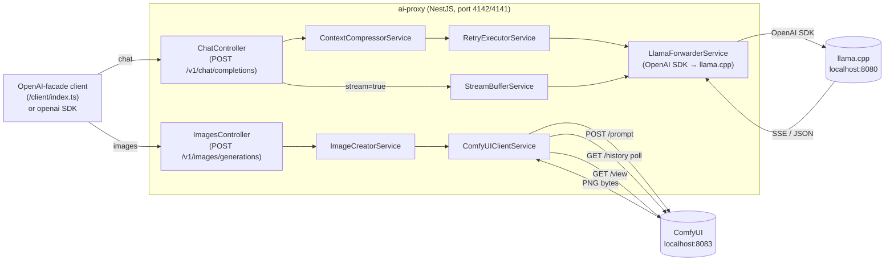
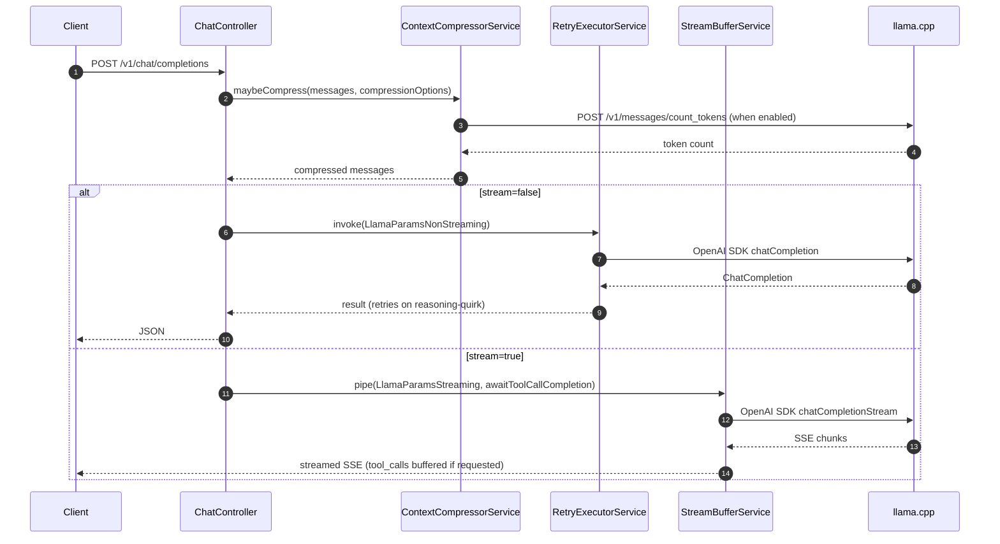
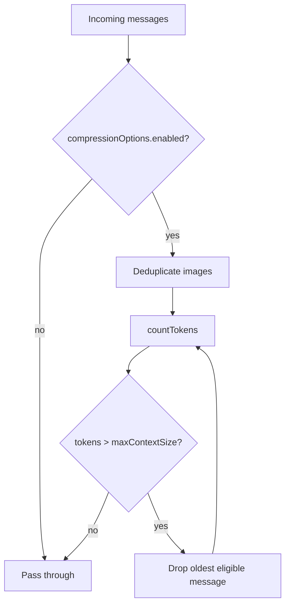
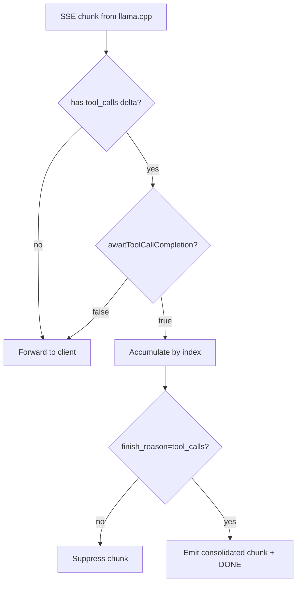

# AI Proxy

## Introduction

`ai-proxy` is an OpenAI-compatible HTTP service that fronts a local llama.cpp server (`localhost:8080`) and adds capabilities the bare server lacks: (1) **context compression** before the request is forwarded, (2) **retry with reasoning-quirk recovery** for the well-known llama.cpp behavior where a model emits only `reasoning_content` and no `content`/`tool_calls`, (3) **server-side tool-call buffering** during streaming so clients can opt out of reassembling streamed JSON fragments, and (4) **image generation** via a local ComfyUI server (`localhost:8083`) using the zib-zit-moody two-stage diffusion workflow.

The proxy is built with **NestJS**, uses the **OpenAI Node SDK** internally to call llama.cpp (typed, SSE-aware), emits an OpenAPI 3 spec at startup via `@nestjs/swagger`, and ships a hand-rolled OpenAI-facade client under `/client` that mirrors the official `openai` npm package interface. Downstream apps install the client via `npm install file:../ai-proxy/client` and call it identically to `openai`.

## External Dependencies

| Service | Default URL | Purpose |
|---|---|---|
| llama.cpp | `localhost:8080` | LLM inference for chat completions |
| ComfyUI | `localhost:8083` | Image generation (zib-zit-moody workflow) |

Override either with env vars: `LLAMA_BASE_URL`, `COMFYUI_BASE_URL`.

## Dev / Prod Ports

| Environment | Port |
|---|---|
| Dev / integration tests | **4142** |
| Prod (`C:\jason\dev\prod`) | **4141** |

## Quick Start

```bash
# Start dev server
PORT=4142 npx ts-node -r tsconfig-paths/register src/main.ts

# Stop dev server
npm run stop-service

# Run all tests (unit + integration — requires dev server + llama.cpp on :8080)
npm run test:all

# Run only image integration tests (requires dev server + ComfyUI on :8083)
npm run test:integration -- --testPathPattern=images

# Regenerate TypeScript client from the OpenAPI spec
npm run generate-client
```

## Image Generation

`POST /v1/images/generations` mirrors the OpenAI images API and adds a `negativePrompt` extension.

### Request

```ts
{
  prompt: string;              // required
  negativePrompt?: string;     // proxy extension — things to avoid in the image
  model?: string;              // ignored for now; always routes to zib-zit-moody workflow
  size?: string;               // "WxH" e.g. "1024x1024", "1920x1080" (default: "1920x1080")
  n?: number;                  // only 1 supported
  response_format?: string;    // always returns b64_json regardless
  quality?: string;            // passed through, not used
  style?: string;              // passed through, not used
}
```

### Response

Standard OpenAI images response shape, always with `b64_json`:

```ts
{
  created: number;
  data: [{
    b64_json: string;        // base64-encoded PNG from ComfyUI
    revised_prompt: string;  // echoes back the input prompt
  }]
}
```

### Workflow

The `zib-zit-moody` workflow is a two-stage pipeline:
1. **1ST K** — base pass using `zib\moodyWildMix_v10Base50steps.safetensors` (17 steps, `res_multistep` sampler)
2. **2ND K** — detail refinement using `moodyPornMix_zitV9.safetensors` (12 steps, `dpmpp_2m_sde`), upscaled by a configurable scale factor (default 1.6×)

The proxy submits the workflow to ComfyUI, polls `/history/{promptId}` every 2 seconds (up to 1 hour), fetches the output image from `/view`, and returns it base64-encoded.

### Client disconnect / cancellation

If the HTTP client closes the connection before generation completes, the proxy automatically cancels the ComfyUI job by calling both:
- `POST /queue { delete: [promptId] }` — removes the job if still pending
- `POST /interrupt` — stops execution if the job is currently running

### Client usage

```ts
import OpenAI from './client';
import type { ImageGenerateParams } from './client';

const openai = new OpenAI({ baseURL: 'http://localhost:4142' });

// Basic generation
const result = await openai.images.generate({
  prompt: 'a serene mountain lake at sunset',
  size: '1920x1080',
});
const pngBuffer = Buffer.from(result.data[0].b64_json!, 'base64');

// With negative prompt (proxy extension)
const result2 = await openai.images.generate({
  prompt: 'a portrait of a woman in soft natural light',
  negativePrompt: 'blurry, low quality, overexposed',
});

// With abort signal — cancels the ComfyUI job on disconnect
const controller = new AbortController();
const result3 = await openai.images.generate(
  { prompt: 'a futuristic cityscape' },
  { signal: controller.signal },
);
```

## Chat Proxy Extensions

`POST /v1/chat/completions` accepts the standard OpenAI body plus these proxy-specific fields:

```ts
{
  // Standard OpenAI params...

  compressionOptions?: {
    enabled: boolean;
    maxContextSize: number;   // token budget; eviction runs when this is exceeded
  };

  awaitToolCallCompletion?: boolean;  // default false; only meaningful when stream=true

  disableThinking?: boolean;          // suppresses reasoning_content via chat_template_kwargs
}
```

## Architecture



### Request lifecycle



## Folder Layout

```
ai-proxy/
  src/
    controllers/
      chat.controller.ts                 # POST /v1/chat/completions
      models.controller.ts               # GET  /v1/models
      images.controller.ts               # POST /v1/images/generations (ComfyUI)
      audioTranscriptions.controller.ts  # stub 501
      audioSpeech.controller.ts          # stub 501
      videos.controller.ts               # stub 501
    services/
      contextCompressor.service.ts       # compression strategies
      retryExecutor.service.ts           # exponential backoff + reasoning-quirk recovery
      streamBuffer.service.ts            # tool-call delta accumulator
      llamaForwarder.service.ts          # OpenAI SDK wrapper → llama.cpp
      stubForwarder.service.ts           # throws 501 for unimplemented modalities
      imageCreator/
        imageCreator.service.ts          # orchestrates workflow selection + ComfyUI call
        comfyUIClient.service.ts         # submit workflow, poll history, fetch image, cancel
        zibZitWorkflow.ts                # builds zib-zit-moody ComfyUI workflow JSON
        jason-moody-zib-zit.json         # base ComfyUI workflow (two-stage diffusion)
    models/
      chatCompletion.dto.ts              # NestJS DTOs (@ApiProperty)
      openaiExtensions.ts                # LlamaParams types built on OpenAI SDK types
      imageCreator/
        imageCreation.dto.ts             # ImageGenerationRequestDto / ResponseDto
    openapi-spec.json                    # written at startup by main.ts
    openapi-spec.rewritten.json          # post-processed spec used by generate-client
  scripts/
    rewrite-spec-names.ts                # strips Dto suffixes, renames operationId
  client/
    generated/                           # typescript-fetch output (auto-generated)
    index.ts                             # hand-rolled OpenAI facade (chat.completions.create)
    proxyExtensions.ts                   # ProxyExtensions type
    package.json
  tests/
    unit/                                # jest unit tests (no network)
    integration/                         # jest integration tests (real proxy + llama.cpp)
```

## Components

### `LlamaForwarderService`

Uses the **OpenAI Node SDK** (not raw `fetch`) to call llama.cpp. The SDK handles SSE framing and typed responses.

```ts
chatCompletion(params: LlamaParamsNonStreaming, signal?): Promise<ChatCompletion>
chatCompletionStream(params: LlamaParamsStreaming, signal?): Promise<Readable>
countTokens(messages: ChatCompletionMessageParam[]): Promise<number>
```

`chatCompletionStream` re-serializes the SDK's `Stream<ChatCompletionChunk>` back to SSE bytes (`data: ...\n\n`) via `sseStreamToReadable` so `StreamBufferService` receives the same `Readable` contract regardless of the underlying transport.

### `RetryExecutorService`

- Exponential backoff: `min(2000 × 2^attempt, 30_000)`, up to 8 attempts.
- Reasoning-quirk recovery: if the response has `reasoning_content` but no `content` and no `tool_calls`, a recovery user message is appended to the payload and the call is retried. The original client history is not mutated.

### `StreamBufferService`

- Passes `content` and `reasoning_content` deltas through immediately.
- When `awaitToolCallCompletion=true`: accumulates `tool_calls` deltas keyed by `index`, suppresses their per-delta chunks, and emits one consolidated chunk on `finish_reason === 'tool_calls'`.
- On reasoning-only stream (empty content, only `reasoning_content`): re-invokes upstream with recovery message appended, forwards the new stream's deltas.

### `ContextCompressorService`

No-op when `compressionOptions.enabled !== true`. When enabled, applies strategies in order:

1. **Image deduplication** — keep only the newest image in tool-call content; clear older ones.
2. **Token-budget eviction** — while `count_tokens > maxContextSize`, drop the oldest message that is not part of the last assistant→tool pair.

### `ImageCreatorService` + `ComfyUIClientService`

Handles `POST /v1/images/generations`. The service layer is split across three files:

**`imageCreator.service.ts`** — high-level orchestration:
- Resolves the model name to a workflow (currently all models → `zib-zit-moody`)
- Parses the `size` string into `width`/`height` integers
- Calls `ComfyUIClientService.runWorkflowAndGetImage()` and wraps the result in the OpenAI response shape

**`comfyUIClient.service.ts`** — ComfyUI HTTP client:
- `submitWorkflow(workflow)` — `POST /prompt`, returns `prompt_id`
- `pollUntilComplete(promptId, signal)` — polls `GET /history/{id}` every 2s up to 1 hour; on `AbortSignal` fires, calls `cancelComfyJob()` before throwing
- `cancelComfyJob(promptId)` — `Promise.allSettled([DELETE queue entry, POST /interrupt])` (mirrors the ang project's cancel route)
- `fetchFirstImageAsBase64(entry)` — `GET /view?filename=...` and base64-encodes the raw bytes

**`zibZitWorkflow.ts`** — pure functions, no NestJS dependency:
- `createZibZitWorkflow({ prompt, negativePrompt, width, height, scale })` — deep-clones `jason-moody-zib-zit.json` and injects the generation parameters into the correct workflow nodes
- `parseSizeToWidthHeight(size?)` — parses `"1024x1024"` → `{ width: 1024, height: 1024 }`; falls back to `1920×1080`

### OpenAPI Spec & Client Generation

`src/main.ts` writes `src/openapi-spec.json` on every boot. The generate-client pipeline:

1. **`scripts/rewrite-spec-names.ts`** post-processes the spec:
   - Strips `Dto` suffix from all schema names and `$ref` paths.
   - Renames `operationId: createCompletion` → `create`.
   - Retags `/v1/chat/completions` as `ChatCompletions` so the generator emits `ChatCompletionsApi`.
2. **`openapi-generator-cli`** (`typescript-fetch`) generates `client/generated/` from the rewritten spec.

```bash
npm run generate-client
```

**Never manually edit `src/openapi-spec.json`.** Always start the app to regenerate it, then run `generate-client`.

### Client Package (`/client`)

The client exposes an OpenAI-SDK-compatible interface. The generated wire types are kept internal; the public surface uses the official `openai` npm types directly.

```ts
import OpenAI from './client';
import type { ChatCompletionMessageParam, ChatCompletionTool } from './client';

const openai = new OpenAI({ baseURL: 'http://localhost:4142' });

// Non-streaming
const result = await openai.chat.completions.create({
  model: 'local-model',
  messages: [{ role: 'user', content: 'Hello' }],
  compressionOptions: { enabled: true, maxContextSize: 4000 },
});

// Streaming
const stream = await openai.chat.completions.create({
  model: 'local-model',
  messages: [{ role: 'user', content: 'Count to 5' }],
  stream: true,
  awaitToolCallCompletion: true,
});
for await (const chunk of stream) { /* ... */ }

// Models
const models = await openai.models.listModels();

// Image generation
const img = await openai.images.generate({
  prompt: 'a mountain lake at sunrise',
  negativePrompt: 'blurry, dark',   // proxy extension
  size: '1920x1080',
});
const png = Buffer.from(img.data[0].b64_json!, 'base64');
```

**Why bypass the generated API in `client/index.ts`?**
The `typescript-fetch` generator renames reserved words (e.g. `function` → `_function` in `ToolDefinition`). Its `ToJSON` mappers fix those at serialization time, but OpenAI SDK types are already correct snake_case wire format. Piping OpenAI params through the generated mappers would silently mangle tool definitions. `postChatCompletion` therefore uses `fetch` + `JSON.stringify(params)` directly, preserving the wire format exactly.

## Data Flows

### Compression



### Stream tool-call buffering



## Testing

Integration-first. All integration tests use the `/client` facade (not raw `fetch`) so the full OpenAI contract is exercised end-to-end.

### Integration tests (`tests/integration/`)

**Chat tests** — require dev server on **:4142** and llama.cpp on **:8080**.

| # | Scenario |
|---|---|
| I1 | Non-stream simple chat — OpenAI response shape |
| I2 | Non-stream with tool call — `tool_calls[0].function.name` correct, args parseable |
| I3 | Streaming simple chat — ≥2 content deltas, `finish_reason=stop` |
| I4 | Streaming with tool, `awaitToolCallCompletion=false` — receives fragmented `tool_calls` deltas |
| I5 | Streaming with tool, `awaitToolCallCompletion=true` — exactly one consolidated chunk with full JSON args |
| I6 | `compressionOptions` evicts old messages — oversized history compresses before forwarding |
| I7 | `compressionOptions` deduplicates images — two image messages accepted, response returned |
| I8 | Vision request — single image forwarded unchanged |
| I9 | Abort signal propagation — non-stream aborts before response; streaming aborts mid-stream cleanly |
| I10 | `disableThinking=true` — `reasoning_content` is blank on response |
| Models | GET /v1/models — returns `object: 'list'` with at least one entry |

**Image tests** — require dev server on **:4142** and ComfyUI on **:8083**. Generated images are saved to `tests/integration/results/images/` (gitignored).

| # | Scenario |
|---|---|
| IM1 | Basic generation — valid base64 PNG returned, correct OpenAI response shape |
| IM2 | `negativePrompt` extension — accepted and returns a valid image |
| IM3 | `revised_prompt` — echoed back matching the input prompt |
| IM4 | `model` param — accepted without error, valid image returned |
| IM5 | Client abort — request throws, ComfyUI queue clears within 15s, proxy remains healthy |

### Unit tests (`tests/unit/`)

| File | Coverage |
|---|---|
| `retryExecutor.spec.ts` | Backoff, reasoning-quirk recovery, retry exhaustion |
| `streamBuffer.spec.ts` | Tool-call accumulation, passthrough, stream recovery |
| `contextCompressor.spec.ts` | Image dedup, token eviction, no-op when disabled |
| `stubForwarder.spec.ts` | 501 responses for all stub modalities |
| `rewriteSpecNames.spec.ts` | Dto stripping, `$ref` rewriting, operationId rename, tag rewrite |
