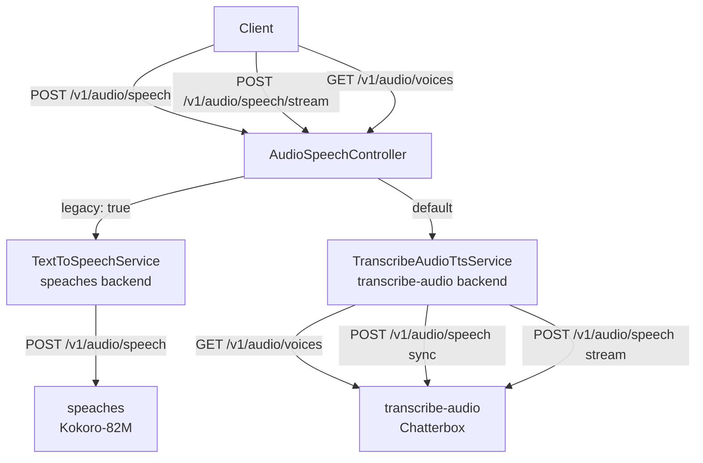
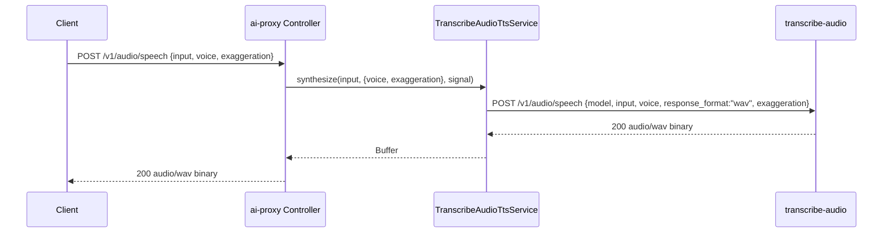
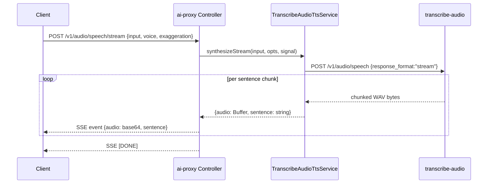

# TDD: Route TTS to Transcribe-Audio (Chatterbox)

## Introduction

The `transcribe-audio` service now includes a Chatterbox-based text-to-speech engine exposed via `GET /v1/audio/voices` and `POST /v1/audio/speech`. The ai-proxy currently routes all TTS requests to the `speaches` backend (Kokoro-82M). This TDD covers updating the ai-proxy to route TTS requests to `transcribe-audio` by default, while preserving the speaches path behind a `legacy` flag — mirroring the same pattern already used in the transcription controller.

## Goals and Non-Goals

**Goals**
- Default all TTS requests in ai-proxy to the `transcribe-audio` service (Chatterbox)
- Preserve speaches code path when `legacy: true` is passed in the request body
- Expose a `GET /v1/audio/voices` endpoint that proxies voice list from `transcribe-audio`
- Support sync TTS and SSE streaming TTS via `transcribe-audio`
- Keep existing integration tests green; add new integration tests for the new paths

**Non-Goals**
- Modifying the `transcribe-audio` service itself
- Supporting non-WAV formats from the Chatterbox path (it only produces WAV)
- Implementing voice management or uploads in ai-proxy
- Changing the speaches integration beyond the `legacy` flag routing

## Problem Statement

All TTS requests in ai-proxy are currently hardwired to speaches (Kokoro-82M). The `transcribe-audio` service now has a production-ready Chatterbox TTS engine with voice listing, sync synthesis, and sentence-level streaming. There is no path to use it from ai-proxy, and callers have no way to list available Chatterbox voices. Migrating the default path unlocks higher-quality synthesis while keeping speaches available for callers that depend on its characteristics (Kokoro voices, speed parameter, MP3 output).

## Architectural Overview



## Detailed Technical Sections

### Components and Interfaces

#### 1. New DTO fields — `AudioSpeechRequestDto`

Add two optional fields to the existing DTO:

```typescript
@IsOptional()
@IsBoolean()
legacy?: boolean;         // routes to speaches when true

@IsOptional()
@IsNumber()
@Min(0.0)
@Max(1.0)
exaggeration?: number;   // Chatterbox cfg_weight; default 0.5
```

`speed` remains valid for the speaches path only. `exaggeration` is Chatterbox-only and ignored on the legacy path.

#### 2. New Service — `TranscribeAudioTtsService`

Location: `src/services/transcribeAudioTts.service.ts`

```typescript
interface SynthesisOptions {
  voice?: string;        // default: first voice from listVoices()
  exaggeration?: number; // default: 0.5
}

class TranscribeAudioTtsService {
  listVoices(): Promise<VoiceDto[]>
  synthesize(input: string, opts: SynthesisOptions, signal?: AbortSignal): Promise<Buffer>
  synthesizeStream(input: string, opts: SynthesisOptions, signal?: AbortSignal): AsyncGenerator<{ audio: Buffer; sentence: string }>
}
```

HTTP target: `TRANSCRIBE_AUDIO_BASE_URL` env var (default `http://localhost:3000`).

- `listVoices` → `GET /v1/audio/voices` → returns `{ voices: VoiceDto[] }`
- `synthesize` → `POST /v1/audio/speech` with `{ model: "tts-1", input, voice, response_format: "wav", exaggeration }` → returns raw WAV `Buffer`
- `synthesizeStream` → `POST /v1/audio/speech` with `response_format: "stream"` → reads chunked response, splits on WAV boundaries, yields per-sentence buffers

#### 3. Controller changes — `AudioSpeechController`

**Sync endpoint** `POST /v1/audio/speech`:

```
if (body.legacy) → TextToSpeechService.synthesize (speaches)
else             → TranscribeAudioTtsService.synthesize (Chatterbox, WAV)
```

**Streaming endpoint** `POST /v1/audio/speech/stream`:

```
if (body.legacy) → TextToSpeechService.synthesizeStream (speaches, SSE)
else             → TranscribeAudioTtsService.synthesizeStream (Chatterbox, SSE)
```

SSE response shape is unchanged: `{ audio: base64, sentence: string }` events, terminated with `[DONE]`.

**New voices endpoint** `GET /v1/audio/voices`:

```typescript
@Get('voices')
async listVoices(): Promise<{ voices: VoiceDto[] }>
```

Proxies `TranscribeAudioTtsService.listVoices()`. No legacy path needed — speaches has no voice-listing API.

#### 4. Config

`src/services/transcribeAudio.config.ts` (already exists for STT — add TTS base URL if not shared):

```typescript
export const TRANSCRIBE_AUDIO_BASE_URL =
  process.env.TRANSCRIBE_AUDIO_BASE_URL || 'http://localhost:3000';
```

### Data Flows and Security

#### Sync TTS (default / Chatterbox)



#### Streaming TTS (default / Chatterbox)



**Error handling:**
- `transcribe-audio` returns 400 (missing input), 404 (unknown voice), 503 (model unavailable) — proxy these as-is
- AbortSignal passed through to fetch; on abort, SSE stream closes and `[DONE]` is not sent
- If `transcribe-audio` is unreachable, return 502 with `{ error: { message, type: "tts_error" } }`

**Security:** No user-supplied data is executed. Inputs are passed as JSON body to a trusted internal service. No format-string or shell interpolation paths.

## Alternatives Considered

| Option | Pros | Cons |
|---|---|---|
| gRPC client in ai-proxy (direct proto) | Lower latency, typed streaming | Adds proto/gRPC dependency; transcribe-audio already exposes HTTP | 
| Keep speaches as default, add Chatterbox as opt-in | Zero risk to existing callers | Doesn't achieve the goal; Chatterbox is the new standard |
| Shared HTTP client library | Reuse across STT and TTS | Premature abstraction; they have different response shapes |

HTTP proxy (chosen) is the simplest path — transcribe-audio already speaks OpenAI-compatible HTTP, so ai-proxy passes bodies straight through with minimal translation.

## Testing Strategy

All tests run against the dev server (port 4141) with `transcribe-audio` running on port 3000.

### Integration Tests (`tests/integration/textToSpeech.integration.spec.ts`)

Update existing tests and add new ones:

| ID | Description | Assertion |
|---|---|---|
| TTS1 | Sync TTS (default → Chatterbox) | 200, `audio/wav`, non-empty buffer |
| TTS2 | Explicit voice + exaggeration params | 200, valid WAV |
| TTS3 | Sync round-trip: TTS → STT word overlap | ≥80% word match |
| TTS4 | Empty input → 400 | HTTP 400 |
| TTS5 | Streaming yields one SSE chunk per sentence | chunk count matches sentences |
| TTS6 | Streaming round-trip per chunk STT | each chunk transcribes correctly |
| TTS7 | Streaming abort | stream closes cleanly, no error thrown |
| TTS8 | Legacy flag → speaches backend | response is MP3 (Content-Type: audio/mpeg) |
| TTS9 | GET /v1/audio/voices | returns array with id/language/gender fields |
| TTS10 | Unknown voice → 404 | HTTP 404 |

Tests TTS1–TTS7 should be updated to exercise the Chatterbox path. TTS8 is the new legacy test. TTS9–TTS10 are new.

### Manual Smoke Test

```
# voices
curl http://localhost:4141/v1/audio/voices

# sync chatterbox
curl -X POST http://localhost:4141/v1/audio/speech \
  -H "Content-Type: application/json" \
  -d '{"input":"Hello world","voice":"dave"}' \
  --output out.wav

# legacy speaches
curl -X POST http://localhost:4141/v1/audio/speech \
  -H "Content-Type: application/json" \
  -d '{"input":"Hello world","legacy":true}' \
  --output out.mp3
```
