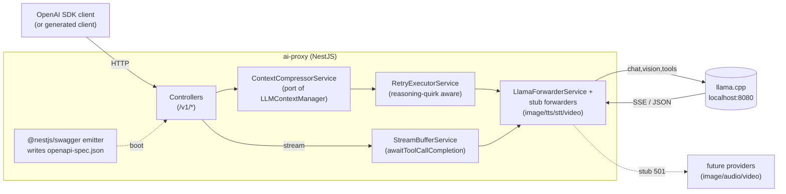
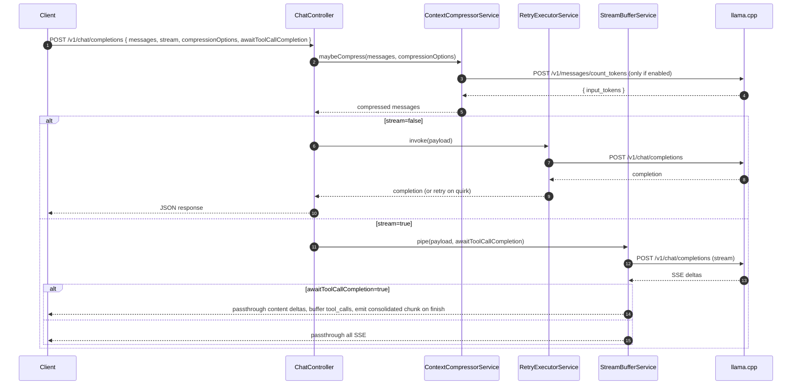
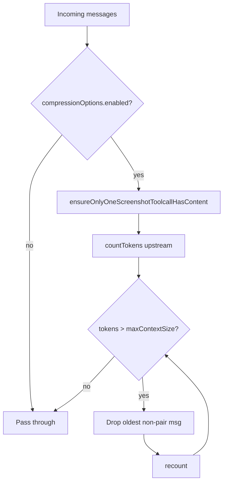
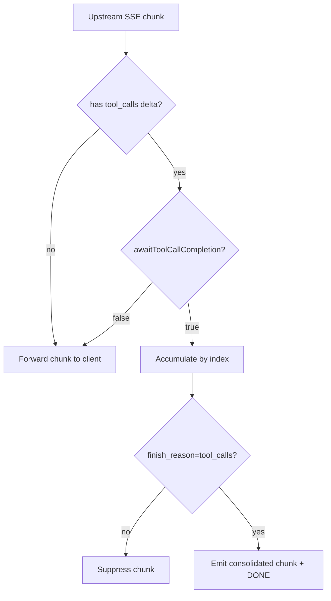

# AI Proxy — Technical Design Document

## Introduction

`ai-proxy` is an OpenAI-compatible HTTP service that fronts a local llama.cpp server (`localhost:8080`) and adds three capabilities the bare server lacks: (1) **context compression** before the request is forwarded, (2) **retry with reasoning-quirk recovery** for the well-known llama.cpp behavior where a model emits only `reasoning_content` and no `content`/`tool_calls`, and (3) **server-side tool-call buffering** during streaming so clients can opt out of reassembling streamed JSON fragments.

The proxy also exposes stubbed routes for modalities the local model does not support (image generation, STT, TTS, video) so that future forwarding to alternate providers can be wired in without changing the public contract. The service is built with **NestJS**, uses `@nestjs/swagger` to generate the OpenAPI 3 spec at startup (matching the `ai-service` setup), and ships a generated `typescript-fetch` client under `/client` for downstream apps to consume via local file install.

## Goals and Non-Goals

### Goals
- OpenAI-compatible `/v1/chat/completions` (streaming + non-streaming, tool calls, vision).
- Drop-in proxy for the official `openai` Node SDK pointed at `http://localhost:<proxy-port>/v1`.
- `compressionOptions` request extension (single `enabled` flag + `maxContextSize`) that, when on, applies all compression strategies ported from `LlamaCppClient/LLMContextManager` (single-image-in-context + older-message eviction). The proxy owns the strategy choices; the caller only opts in.
- `awaitToolCallCompletion` request extension that buffers all streamed tool-call deltas and emits a single consolidated chunk to the client.
- Retry with exponential backoff on upstream failures **and** on the reasoning-only-no-content quirk (non-stream), with stream-time detection where feasible.
- `reasoning_content` is preserved on response messages and stream deltas.
- Stubbed (501-returning) handlers for `/v1/images/generations`, `/v1/audio/transcriptions`, `/v1/audio/speech`, `/v1/videos/generations` with a single forwarding hook seam.
- `openapi-spec.json` written to disk at boot.
- Generated `typescript-fetch` client at `/client` with its own `package.json` + README explaining `npm install file:../path/to/client`.
- Integration tests using the generated client against a real `llama.cpp` instance for the happy paths; mocked upstream for retry/error paths.

### Non-Goals
- Auth, rate limiting, multi-tenant API key management.
- Persistence (no DB; the proxy is stateless across requests).
- Image/audio/video forwarding implementations (stubs only this iteration).
- A web UI or admin surface.
- Embeddings, moderation, files, batches endpoints.
- Reimplementing token counting; we delegate to llama.cpp's `/v1/messages/count_tokens`.

## Problem Statement

Today every consuming app (e.g. `job-apply-v2`) duplicates the same llama.cpp glue: retry loops, reasoning-content recovery, ad-hoc context compression, and tool-call stream reassembly. The logic is non-trivial (see `LlamaCppClient.ts:60-113` and `LLMContextManager.ts:104-142`) and drifts between callers. A second pain point: callers that want a clean tool-call object must buffer streamed deltas themselves, which is error-prone when the model interleaves reasoning, content, and tool fragments. Finally, clients that want vision against the local model but image generation against a hosted provider currently have to multiplex providers themselves. Centralizing this into one OpenAI-shaped proxy lets every consumer drop the boilerplate and switch providers/policies in one place.

## Architectural Overview



### Request lifecycle



## Components and Interfaces

### Folder layout

Follows the layered structure from `~/.claude/CLAUDE.md` (controllers → services → utils → models) and mirrors `ai-service`'s NestJS conventions.

```
ai-proxy/
  src/
    controllers/
      chat.controller.ts                # POST /v1/chat/completions
      images.controller.ts              # POST /v1/images/generations (stub 501)
      audioTranscriptions.controller.ts # POST /v1/audio/transcriptions (stub 501)
      audioSpeech.controller.ts         # POST /v1/audio/speech (stub 501)
      videos.controller.ts              # POST /v1/videos/generations (stub 501)
      models.controller.ts              # GET  /v1/models
    services/
      contextCompressor.service.ts
      retryExecutor.service.ts
      streamBuffer.service.ts
      llamaForwarder.service.ts
      stubForwarder.service.ts          # throws NotImplementedError; one method per modality
    utils/
      sse.ts                            # SSE parse/encode helpers
      tokens.ts                         # estimation fallback
    models/
      chatCompletion.dto.ts             # class-validator DTOs w/ @ApiProperty
      compressionOptions.dto.ts
      common.dto.ts
    app.module.ts                       # dynamic loader, same pattern as ai-service
    main.ts                             # SwaggerModule.createDocument + writeFileSync
  client/                               # generated typescript-fetch client (own package.json + README)
  openapi-spec.json                     # written at boot by main.ts
  nest-cli.json
  tsconfig.json
  package.json                          # has "generate-ai-client-win" script
```

### Public API (additions on top of OpenAI spec)

`POST /v1/chat/completions` accepts the standard OpenAI body plus:

```ts
{
  // ...standard ChatCompletionCreateParams
  compressionOptions?: {
    enabled: boolean;
    maxContextSize: number;            // tokens — only consulted when enabled=true
  };
  awaitToolCallCompletion?: boolean;   // default false; only meaningful when stream=true
}
```

When `compressionOptions.enabled === true`, the proxy applies **all** built-in compression strategies in order:
1. `ensureOnlyOneScreenshotToolcallHasContent` — keep only the newest tool image.
2. `removeOlderMessagesFromHistoryUntilContextIsLessThanNTokens(maxContextSize)` — evict from the front, preserving the last assistant→tool pair.

The caller does not pick individual strategies — opting in opts in to all of them. New strategies added later apply automatically when `enabled=true`. DTOs are defined with `class-validator` decorators and `@ApiProperty` so `@nestjs/swagger` picks them up for `openapi-spec.json`.

Responses match OpenAI shape, with `reasoning_content` preserved on the assistant message (and on stream `delta` objects) as a non-standard field.

### `ContextCompressorService`

```ts
@Injectable()
class ContextCompressorService {
  constructor(private readonly forwarder: LlamaForwarderService) {}
  async compress(messages: ChatMessage[], opts: CompressionOptionsDto): Promise<ChatMessage[]>;
}
```
- No-op when `opts?.enabled !== true`.
- When enabled, runs the full strategy chain (image dedup → older-message eviction). Caller cannot disable individual steps.
- Ports `ensureOnlyOneScreenshotToolcallHasContent` and `removeOlderMessagesFromHistoryUntilContextIsLessThanNTokens` from `LLMContextManager.ts`.
- Drops the "sent message tracking" concept: the proxy is stateless, so every message that is not part of the **last assistant→tool pair** (and isn't message[0] system) is eligible for removal. The "last tool pair preserved" guard is kept verbatim.
- Token counting via `forwarder.countTokens()` → `/v1/messages/count_tokens`. Fallback to char-based estimation (`utils/tokens.ts`) if the endpoint errors.

### `RetryExecutorService` (non-stream path)

```ts
@Injectable()
class RetryExecutorService {
  constructor(private readonly forwarder: LlamaForwarderService) {}
  async invoke(payload: ChatCompletionCreateParams): Promise<ChatCompletion>;
}
```
- Exponential backoff: `min(2000 * 2^(attempt-1), 30000)`, max 8 attempts (constants from `LlamaCppClient.ts:5-7`).
- Quirk: if the response has `reasoning_content` but no `content` and no `tool_calls`, append a recovery user message to the payload (`"You reasoned but did not respond... ${reasoning_content}. Please continue."`) and retry. This mutates the in-flight payload only — the original client message history is untouched.
- Surfaces last error after retry exhaustion.

### `StreamBufferService` (stream path)

```ts
@Injectable()
class StreamBufferService {
  constructor(private readonly forwarder: LlamaForwarderService) {}
  pipe(payload: ChatCompletionCreateParams, opts: { awaitToolCallCompletion: boolean }): NodeJS.ReadableStream;
}
```
- Always passes through `content` and `reasoning_content` deltas immediately.
- When `awaitToolCallCompletion=true`: accumulates `tool_calls` deltas keyed by `index`, suppresses their per-delta SSE chunks, then on `finish_reason === 'tool_calls'` emits one synthetic SSE chunk containing the fully assembled `tool_calls` array before the original `[DONE]`.
- Stream-time reasoning-quirk detection: tracked but **not auto-recovered mid-stream** — restarting an SSE stream transparently to the client is not safe (clients have already received partial chunks). Instead, on detecting `finish_reason='stop'` with only `reasoning_content` accumulated, the buffer emits a final synthetic `delta.content` carrying the recovery prompt result by re-invoking the upstream **once** with the recovery message appended, then forwards the new stream's deltas. If that retry also yields nothing, emit an `error` event in the SSE stream and close. This trade-off is documented in the response headers (`x-ai-proxy-stream-recovery: <count>`).

### `LlamaForwarderService`

`@Injectable()` wrapper over `fetch` to `http://localhost:8080`:
- `chatCompletion(payload)` — non-stream, returns parsed JSON.
- `chatCompletionStream(payload)` — returns `NodeJS.ReadableStream` of SSE bytes.
- `countTokens(systemPrompt, messages, tools)` — POSTs `/v1/messages/count_tokens`, mirrors logic in `LlamaCppClient.ts:115-142` (handles "No user query found" and assistant-prefill quirks).

### Stub handlers

```ts
// src/controllers/images.controller.ts
@Controller('v1/images')
export class ImagesController {
  constructor(private readonly stub: StubForwarderService) {}

  @Post('generations')
  @ApiOperation({ summary: 'Image generation (not implemented — stub)' })
  generate() {
    return this.stub.imageGeneration();   // throws NotImplementedException → 501
  }
}
```
`StubForwarderService` exposes one method per modality (`imageGeneration`, `audioTranscription`, `audioSpeech`, `videoGeneration`), each throwing Nest's `NotImplementedException`. Future work swaps the throw for a real provider call without touching the controller.

### OpenAPI emission

Mirrors `ai-service/src/main.ts:17-32` exactly:

```ts
// src/main.ts (excerpt)
const config = new DocumentBuilder()
  .setTitle('AI Proxy API')
  .setDescription('OpenAI-compatible proxy for llama.cpp with compression, retry, and tool-call buffering')
  .setVersion('1.0')
  .build();
const document = SwaggerModule.createDocument(app, config, {
  operationIdFactory: (_controllerKey, methodKey) => methodKey,
});
SwaggerModule.setup('api', app, document);
writeFileSync(join(__dirname, '..', 'src', 'openapi-spec.json'), JSON.stringify(document, null, 2));
```

- DTOs use `@ApiProperty` decorators so `@nestjs/swagger` reflects schemas without a separate zod layer.
- `package.json` script (verbatim from the project brief):
  `"generate-ai-client-win": "npx openapi-generator-cli generate -i src/openapi-spec.json -g typescript-fetch -o ./src/client/api-client --additional-properties=useSingleRequestParameter=false"`
- A second script `generate-client` runs the same generator into `/client/src` (the standalone consumable package) and then `tsc` inside `/client`.

### Generated client package (`/client`)

- Own `package.json` with `name: "@local/ai-proxy-client"`, `main: "dist/index.js"`, `types: "dist/index.d.ts"`.
- README: install via `npm install file:../ai-proxy/client` and a 10-line usage example pointing at `http://localhost:<port>`.

## Data Flows and Security

### Compression flow



### Stream tool-call buffering



### Risks & mitigations

| Risk | Mitigation |
|---|---|
| Mid-stream retry violates already-emitted bytes | Don't retry mid-stream; only attempt the documented quirk recovery on `finish_reason=stop` with empty content; surface failure via SSE `error` event. |
| `count_tokens` endpoint quirks (500 on empty, 400 on assistant-last) | Replicate `LlamaCppClient.ts:117-123` workaround: append a `user: " "` placeholder when needed. |
| Compression evicts a tool-call without its result (or vice versa) | Reuse `findLastToolPairAssistantIndex` guard from `context-compression.ts:108`; never shift past `pairStart`. |
| Generated client drifts from running server | Boot-time write of `openapi-spec.json` + CI step `npm run generate-client && git diff --exit-code client/`. |
| Proxy adds latency in stream path | Pass-through is byte-aligned; only tool-call deltas are buffered (small JSON), no decode of content text. |
| llama.cpp returns malformed SSE | Wrap parser in try/catch per chunk; on parse error, forward the raw chunk and log. Do not swallow upstream bytes. |
| No auth (proxy on localhost) | Bind to `127.0.0.1` only by default; document that exposing publicly requires the user to add an auth middleware. |

## Alternatives Considered

| Alternative | Pros | Cons | Verdict |
|---|---|---|---|
| **Next.js** (App Router, route handlers) | Lighter-weight for a stateless proxy; one process for API + static assets if ever needed. | No built-in DI, weaker OpenAPI ecosystem (need `zod-to-openapi` glue), diverges from user's other services. | Rejected — user explicitly asked for NestJS. |
| **Hono / Fastify** | Lower overhead, simpler streaming. | New stack for the user; no existing OpenAPI ecosystem as polished as `@nestjs/swagger`; diverges from `ai-service`. | Rejected — stack consistency wins. |
| **Direct fork of `LlamaCppClient`** as a library, no HTTP proxy | Zero network hop, simplest. | Doesn't satisfy "OpenAI-compatible HTTP" requirement, can't intercept image/audio/video routes, can't be consumed by non-Node clients. | Rejected. |
| **Mid-stream retry** for reasoning quirk | Fully transparent recovery. | Cannot un-send bytes already flushed to the client; protocol-level lie. | Rejected — only end-of-stream recovery is safe. |
| **Buffer the entire stream** when `awaitToolCallCompletion=true` (not just tool calls) | Simpler implementation. | Defeats streaming for content tokens; users want content streaming AND tool-call atomicity. | Rejected — only tool-call deltas are buffered. |
| **Persist sent-message tracking** (like `LLMContextManager`) | Enables more aggressive eviction. | Requires server-side session state; breaks statelessness; clients already control history. | Rejected — caller owns history. |

## Testing Strategy

Integration-first per project convention. All tests use the **generated client** (not raw `fetch`) so the OpenAPI contract is exercised end-to-end.

### Integration tests (real llama.cpp at `localhost:8080`)

| # | Scenario | Assertion |
|---|---|---|
| I1 | Non-stream simple chat | `choices[0].message.content` non-empty; matches OpenAI shape. |
| I2 | Non-stream with tool (calculator: `add(a,b)`) | `tool_calls[0].function.name === 'add'`; arguments parse to `{a, b}`. |
| I3 | Streaming simple chat | Receives ≥2 `delta.content` chunks; final `finish_reason === 'stop'`. |
| I4 | Streaming with tool, `awaitToolCallCompletion=false` | Receives multiple `tool_calls` deltas (fragmented args). |
| I5 | Streaming with tool, `awaitToolCallCompletion=true` | Receives exactly **one** `tool_calls` chunk with fully-formed JSON args; precedes `[DONE]`. |
| I6 | `compressionOptions.enabled=true`, `maxContextSize=200`, oversized history | Upstream payload (captured via spy in forwarder) contains fewer messages than input; last assistant→tool pair preserved. |
| I7 | `compressionOptions.enabled=true` with two image tool-result messages | Older tool image content cleared; newest retained (strategy applied automatically — no per-strategy flag). |
| I8 | Vision request (one image) | Forwarded unchanged; response includes assistant content. |
| I9 | `reasoning_content` echoed on response | Field present on `message` (non-stream) and on at least one `delta` (stream) when model thinks. |

### Mocked-upstream tests (jest with `nock` or fetch stub)

| # | Scenario | Assertion |
|---|---|---|
| M1 | Upstream 500 then 200 | Single retry; client sees 200. |
| M2 | Upstream 500 × 9 | Client sees 5xx after backoff exhaustion; backoff delays match `min(2000*2^n, 30000)`. |
| M3 | Reasoning-only response then valid response | Recovery user message added to upstream payload on attempt 2; client sees valid content. |
| M4 | Stream ends with `finish_reason=stop` and only `reasoning_content` | Recovery re-invocation triggered; client receives recovered `delta.content`; header `x-ai-proxy-stream-recovery: 1`. |
| M5 | Upstream malformed SSE chunk | Chunk forwarded raw; subsequent valid chunks still parsed; no stream abort. |
| M6 | `count_tokens` returns 500 "No user query found" with empty messages | Fallback placeholder `user: " "` injected; second call succeeds. |
| M7 | Image/STT/TTS/Video endpoints | Return 501 with `error.type === 'not_implemented'`. |

### Contract tests
- **C1**: Boot the server, assert `openapi-spec.json` exists and is valid OpenAPI 3.
- **C2**: Run `npm run generate-client`, assert `git diff --exit-code client/src` is clean (regenerated client matches committed client).

### Out of scope for tests
- Performance / load.
- Real provider calls for image/audio/video (stubs only).
- TLS / auth (no auth in this iteration).
