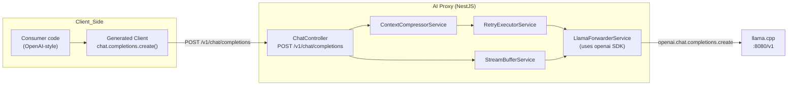
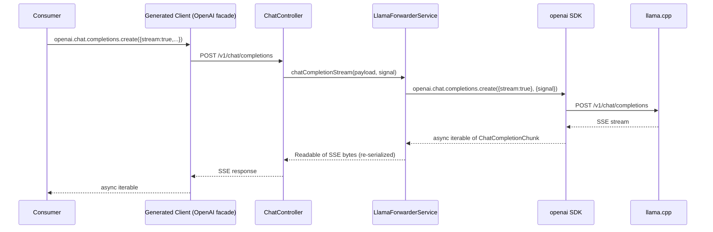

# TDD — OpenAI SDK + OpenAI-Shaped Generated Client

## Introduction

We currently talk to `llama.cpp` from `LlamaForwarderService` via raw `fetch` calls, and we expose an OpenAPI-generated TypeScript client whose models all carry a `Dto` suffix (`ChatCompletionRequestDto`, `ChatMessageDto`, etc.). Consumers that already know the OpenAI SDK shape have to learn a parallel vocabulary for no real gain.

This TDD covers two related changes: (1) replace the internal `fetch` usage in `LlamaForwarderService` with the `openai` SDK (`chat.completions.create`, including the SDK's built-in streaming support), and (2) reshape the generated client so its class, method, and model names mirror the `openai` npm package — while still allowing our proxy-specific extensions (`disableThinking`, `compressionOptions`, `awaitToolCallCompletion`).

## Goals and Non-Goals

### Goals
- `LlamaForwarderService.chatCompletion` and `chatCompletionStream` use `openai.chat.completions.create` under the hood, not `fetch`.
- `countTokens` still uses `fetch` (not an OpenAI SDK endpoint) — unchanged.
- The generated client re-exports (or is generated such that) a consumer can write:
  ```ts
  import OpenAI from '@our/generated-client';
  const openai = new OpenAI({ baseURL, apiKey });
  await openai.chat.completions.create({ model, messages, stream: true, disableThinking: true });
  ```
- Generated model names drop the `Dto` suffix (`ChatCompletionRequest`, `ChatMessage`, `ToolCall`, `Usage`, etc.).
- Generated method is named `create` on a `chat.completions` namespace, not `createCompletion` on `ChatApi`.
- Proxy extension params (`disableThinking`, `compressionOptions`, `awaitToolCallCompletion`) remain typed on the request.
- All existing integration tests pass.

### Non-Goals
- Changing server-side DTO class names. Internal NestJS DTOs keep their `Dto` suffix.
- Swapping out the OpenAPI generator for a different one. We stay on `typescript-fetch`.
- Supporting every `openai` SDK feature (embeddings, files, assistants) — only the surface we actually implement.
- Abort-signal wiring changes beyond what the `openai` SDK already supports.

## Problem Statement

**Current state:**
- `src/services/llamaForwarder.service.ts` POSTs to `${LLAMA_BASE_URL}/v1/chat/completions` using `fetch`, then wraps the response body into a `Readable` for streaming. We re-implement logic the `openai` SDK already provides.
- `client/models/*.ts` is a collection of `*Dto` types auto-generated from our NestJS `@ApiProperty` decorators. `client/apis/ChatApi.ts` exposes `createCompletion(chatCompletionRequestDto)`.
- Consumers who already use `openai` have to translate type names (`ChatCompletionMessageParam` → `ChatMessageDto`) and method shapes (`openai.chat.completions.create` → `new ChatApi().createCompletion`).

**Pain points:**
- Duplicate streaming + error-handling code in `LlamaForwarderService` that the SDK handles.
- Cognitive overhead for callers who know OpenAI conventions.
- `Dto` suffix leaks server-side nomenclature into client code.

**Impact:** low correctness risk, real ergonomics cost. Every new consumer re-learns the shape, and we can't cleanly drop in code snippets from OpenAI docs.

## Architectural Overview



## Detailed Technical Sections

### Components and Interfaces

#### 1. `LlamaForwarderService` (refactor)

Replace `fetch` with an injected `OpenAI` instance pointed at `LLAMA_BASE_URL`. Use the SDK's own types — no `Record<string, unknown>` and no `any`.

SDK types we rely on (all from `openai/resources/chat/completions`):

| SDK type | Role |
|---|---|
| `ChatCompletionCreateParamsBase` | Common request shape (model, messages, tools, temperature, tool_choice, max_tokens, …). |
| `ChatCompletionCreateParamsNonStreaming` | `stream?: false \| null`. |
| `ChatCompletionCreateParamsStreaming` | `stream: true`. |
| `ChatCompletionMessageParam` | Union of system/user/assistant/tool message params. |
| `ChatCompletionMessageToolCall` | `{ id, type: 'function', function: { name, arguments } }`. |
| `ChatCompletionTool` | `{ type: 'function', function: FunctionDefinition }`. |
| `ChatCompletionToolChoiceOption` | `'none' \| 'auto' \| 'required' \| { type: 'function', function: { name } }`. |
| `ChatCompletion` | Non-stream response. |
| `ChatCompletionChunk` | Stream chunk. |
| `Stream<ChatCompletionChunk>` (from `openai/streaming`) | Returned when `stream: true`. |

**Proxy extensions.** We extend the SDK type rather than casting — the SDK ignores unknown fields server-side, but we want compile-time safety locally:

```ts
// src/models/openaiExtensions.ts
import type {
  ChatCompletionCreateParamsNonStreaming,
  ChatCompletionCreateParamsStreaming,
} from 'openai/resources/chat/completions';
import type { CompressionOptionsDto } from './compressionOptions.dto';

export type ProxyExtensions = {
  disableThinking?: boolean;
  compressionOptions?: CompressionOptionsDto;
  awaitToolCallCompletion?: boolean;
  chat_template_kwargs?: { enable_thinking?: boolean };
};

export type ProxyChatCompletionCreateParamsNonStreaming =
  ChatCompletionCreateParamsNonStreaming & ProxyExtensions;

export type ProxyChatCompletionCreateParamsStreaming =
  ChatCompletionCreateParamsStreaming & ProxyExtensions;

export type ProxyChatCompletionCreateParams =
  | ProxyChatCompletionCreateParamsNonStreaming
  | ProxyChatCompletionCreateParamsStreaming;
```

**Service shape:**

```ts
import OpenAI from 'openai';
import type { ChatCompletion, ChatCompletionChunk } from 'openai/resources/chat/completions';
import type { Stream } from 'openai/streaming';
import type {
  ProxyChatCompletionCreateParamsNonStreaming,
  ProxyChatCompletionCreateParamsStreaming,
} from '../models/openaiExtensions';

@Injectable()
export class LlamaForwarderService {
  private readonly openai = new OpenAI({
    baseURL: `${process.env.LLAMA_BASE_URL || 'http://localhost:8080'}/v1`,
    apiKey: process.env.LLAMA_API_KEY || 'not-needed',
  });

  async chatCompletion(
    params: ProxyChatCompletionCreateParamsNonStreaming,
    signal?: AbortSignal,
  ): Promise<ChatCompletion> {
    return this.openai.chat.completions.create({ ...params, stream: false }, { signal });
  }

  async chatCompletionStream(
    params: ProxyChatCompletionCreateParamsStreaming,
    signal?: AbortSignal,
  ): Promise<Readable> {
    const stream: Stream<ChatCompletionChunk> =
      await this.openai.chat.completions.create({ ...params, stream: true }, { signal });
    return sseStreamToReadable(stream, signal);
  }

  async countTokens(/* unchanged — uses fetch */) {}
}
```

- `sseStreamToReadable(stream: Stream<ChatCompletionChunk>, signal?: AbortSignal): Readable` iterates the SDK's async iterable and re-serializes each chunk as `data: ${JSON.stringify(chunk)}\n\n`, followed by a terminal `data: [DONE]\n\n`. Keeps `StreamBufferService`'s existing SSE-parsing contract intact.
- **Caller changes.** `ChatController` today strips proxy extensions and rebuilds a `Record<string, unknown>` payload. It will instead build a `ProxyChatCompletionCreateParamsNonStreaming` / `…Streaming`. `RetryExecutorService.invoke` and `StreamBufferService.pipe` take typed params instead of `Record<string, unknown>`.
- **`ChatMessage` alias removed.** The local `ChatMessage` type in `llamaForwarder.service.ts` is replaced by `ChatCompletionMessageParam` at call sites. `ContextCompressorService.compress` accepts and returns `ChatCompletionMessageParam[]`.

#### 2. Generated Client — OpenAI-shaped naming

Two levers in `openapi-generator-cli`:

**a. Drop the `Dto` suffix via OpenAPI schema renaming.** The generator uses the `$ref` schema names from `openapi-spec.json`. NestJS Swagger currently names them after the TypeScript class (`ChatCompletionRequestDto`). Fix by setting `schemaName` in `@ApiExtraModels` / using the `name` option on the DTO, or via a post-generation pass that rewrites `openapi-spec.json` before `generate-client` runs.

Preferred approach: **spec post-processor script** (`scripts/rewrite-spec-names.ts`) that runs between spec generation and client generation:
- Strips `Dto` suffix from `components.schemas.*` keys.
- Rewrites all `$ref: '#/components/schemas/FooDto'` to `$ref: '#/components/schemas/Foo'`.
- Renames `operationId: 'createCompletion'` to `'create'` on the chat completions path.
- Tags/groups operations so generator emits a `chat.completions` namespace. (`typescript-fetch` emits one API class per tag — we split the `chat` tag into separate `ChatCompletionsApi` etc. if needed, then hand-roll a thin `index.ts` that assembles them as `chat.completions`.)

**b. Hand-rolled `OpenAI` facade (`client/index.ts`).** Generator output alone can't produce the `new OpenAI().chat.completions.create(...)` shape with OpenAI-identical types. We add a small wrapper that **re-exports the actual `openai` package types** so consumer code is indistinguishable from using the real SDK:

```ts
// client/index.ts (hand-written, not regenerated)
import { Configuration, ChatCompletionsApi } from './generated';
import type {
  ChatCompletionCreateParamsNonStreaming,
  ChatCompletionCreateParamsStreaming,
  ChatCompletion,
  ChatCompletionChunk,
} from 'openai/resources/chat/completions';
import type { ProxyExtensions } from './proxyExtensions';

type CreateParamsNonStreaming = ChatCompletionCreateParamsNonStreaming & ProxyExtensions;
type CreateParamsStreaming = ChatCompletionCreateParamsStreaming & ProxyExtensions;

class Completions {
  constructor(private api: ChatCompletionsApi) {}

  create(params: CreateParamsNonStreaming, opts?: { signal?: AbortSignal }): Promise<ChatCompletion>;
  create(params: CreateParamsStreaming, opts?: { signal?: AbortSignal }): Promise<AsyncIterable<ChatCompletionChunk>>;
  create(params: CreateParamsNonStreaming | CreateParamsStreaming, opts?: { signal?: AbortSignal }):
    Promise<ChatCompletion | AsyncIterable<ChatCompletionChunk>> { /* routes to api */ }
}

export default class OpenAI {
  chat: { completions: Completions };
  constructor(opts: { baseURL: string; apiKey?: string }) {
    const cfg = new Configuration({ basePath: opts.baseURL, apiKey: opts.apiKey });
    this.chat = { completions: new Completions(new ChatCompletionsApi(cfg)) };
  }
}

// Re-export OpenAI's own types — no parallel vocabulary for consumers.
export type {
  ChatCompletionMessageParam,
  ChatCompletionMessageToolCall,
  ChatCompletionTool,
  ChatCompletionToolChoiceOption,
  ChatCompletion,
  ChatCompletionChunk,
  ChatCompletionCreateParams,
} from 'openai/resources/chat/completions';
export type { ProxyExtensions } from './proxyExtensions';
```

- `client/proxyExtensions.ts` (hand-written) exports the `ProxyExtensions` type (`disableThinking`, `compressionOptions`, `awaitToolCallCompletion`).
- The generator output under `client/generated/` still contains `ChatCompletionRequest`, `ChatMessage`, etc. — those exist for the HTTP wire layer (JSON encode/decode), but consumers import from the top-level facade and get OpenAI's canonical type names.
- Consumer dep: `openai` must be a peer/direct dep of the client package so the re-exports resolve. We'll add `openai` to `client/package.json` dependencies.

#### 3. Data Models — two layers

**Layer A — wire types (generated, under `client/generated/models/`).** Used only for JSON encode/decode by the generated API class. Names drop `Dto`:

| Before | After |
|---|---|
| `ChatCompletionRequestDto` | `ChatCompletionRequest` |
| `ChatCompletionResponseDto` | `ChatCompletionResponse` |
| `ChatMessageDto` | `ChatMessage` |
| `ChatChoiceDto` | `ChatChoice` |
| `ToolCallDto` | `ToolCall` |
| `ToolDefinitionDto` | `ToolDefinition` |
| `ToolFunctionDto` | `ToolFunction` |
| `FunctionCallDto` | `FunctionCall` |
| `UsageDto` | `Usage` |
| `CompressionOptionsDto` | `CompressionOptions` |
| `ModelObjectDto` | `ModelObject` |
| `ModelsListResponseDto` | `ModelsListResponse` |

**Layer B — public types (re-exported from `openai` package via `client/index.ts`).** What consumers import. Names match OpenAI SDK exactly:

| Public type | Source |
|---|---|
| `ChatCompletionMessageParam` | `openai/resources/chat/completions` |
| `ChatCompletionMessageToolCall` | `openai/resources/chat/completions` |
| `ChatCompletionTool` | `openai/resources/chat/completions` |
| `ChatCompletionToolChoiceOption` | `openai/resources/chat/completions` |
| `ChatCompletion` | `openai/resources/chat/completions` |
| `ChatCompletionChunk` | `openai/resources/chat/completions` |
| `ChatCompletionCreateParams` | `openai/resources/chat/completions` |
| `ProxyExtensions` | `client/proxyExtensions.ts` |

The two layers are structurally compatible by construction (both derived from the same NestJS DTOs, whose `@ApiProperty` shapes mirror the OpenAI schema). Compatibility is enforced by a type-level compile-time assertion in the facade:

```ts
// client/index.ts — compile-time proof that wire type ⊇ OpenAI type (for the fields we actually send)
type _AssertRequestCompat = ChatCompletionCreateParams extends Partial<ChatCompletionRequest> ? true : never;
```

If the NestJS DTOs ever drift from the OpenAI shape, the build fails.

Proxy extensions (`disableThinking`, `compressionOptions`, `awaitToolCallCompletion`) live on `ProxyExtensions` and are intersected into the `create()` param type — not part of the base OpenAI type.

#### 4. Build Pipeline

Update `package.json`:

```json
"generate-client": "npx ts-node scripts/rewrite-spec-names.ts && npx openapi-generator-cli generate -i src/openapi-spec.json.rewritten -g typescript-fetch -o ./client/generated --additional-properties=useSingleRequestParameter=false"
```

- `rewrite-spec-names.ts` reads `src/openapi-spec.json`, outputs `src/openapi-spec.json.rewritten`.
- `client/index.ts` (hand-written facade) imports from `./generated`.

### Data Flows and Security



**Risks:**
- **SDK re-serialization overhead.** Wrapping SDK chunks back to SSE bytes costs CPU. Acceptable — local-only traffic, small.
- **Abort semantics differ.** `openai` SDK accepts `{signal}` in request options; verify cancellation propagates to the underlying `fetch`. Covered by integration test.
- **Hand-rolled facade drift.** If generator output changes (new tag, renamed class), `client/index.ts` must be updated manually. Mitigated by a smoke test that imports `OpenAI` and calls `create` against a mock server.
- **Name collisions.** After stripping `Dto`, `ChatMessage` is fine, but verify no server-side type leaks into client imports with the new name.
- **No new auth surface.** `apiKey` is forwarded to the proxy but unused by the proxy today.

## Alternatives Considered

| Option | Pros | Cons |
|---|---|---|
| **A. Post-process spec + hand-rolled OpenAI facade (chosen)** | Keeps `typescript-fetch` generator; small, reviewable facade; proxy extensions typed naturally. | Facade is hand-written — needs a smoke test to catch generator drift. |
| B. Rename server DTOs (strip `Dto` from NestJS classes) | One source of truth; no post-process step. | Breaks internal convention (`*Dto` for DTOs); conflicts with user coding style; large blast radius in `src/`. |
| C. Switch generator (e.g., `openapi-typescript-codegen`, `openapi-ts`) | Some generators emit cleaner names natively. | Big migration; loses known-good `typescript-fetch` runtime; unclear it hits the exact OpenAI shape. |
| D. Refactor `StreamBufferService` to consume SDK async iterable directly (skip SSE re-serialization) | Cleaner internal flow; drops the bridge. | Larger change; `StreamBufferService`'s recovery logic is coupled to raw SSE chunks. Defer. |
| E. Keep `fetch` in `LlamaForwarderService` (no SDK swap) | Zero churn. | Fails task goal #1; keeps duplicated streaming code. |

## Testing Strategy

Favor functional / integration tests. Current `tests/integration/chat.integration.spec.ts` already covers the controller end-to-end against a stub forwarder — extend it.

### Integration tests (new / updated)

1. **`LlamaForwarderService` with mocked OpenAI SDK**
   - Use `nock` or `msw/node` to intercept HTTP at the network layer (not mock the SDK object). Assert the proxy's `openai` instance hits `${LLAMA_BASE_URL}/v1/chat/completions` with the expected body shape.
   - Cases: non-stream success, stream success (yields chunks), HTTP 500 surfaces as error, abort signal cancels in-flight request.

2. **End-to-end via generated client (new `tests/integration/generated-client.integration.spec.ts`)**
   - Boot the Nest app against `StubForwarderService`.
   - Import the generated client: `import OpenAI from '../../client'`.
   - `new OpenAI({ baseURL }).chat.completions.create({ model, messages })` — asserts the facade wiring.
   - Streaming variant: `create({ stream: true })` returns an async iterable; consume it and assert chunk shape.
   - Proxy extension: request with `{ disableThinking: true, compressionOptions: {...} }` compiles and reaches the server.

3. **Spec post-processor unit test (`tests/unit/rewriteSpecNames.spec.ts`)**
   - Feed a fixture spec with `FooDto`, `$ref: '#/components/schemas/FooDto'`, and `operationId: createCompletion`.
   - Assert output has `Foo`, rewritten `$ref`, and `operationId: create`.
   - Edge cases: schema name that doesn't end in `Dto` is untouched; nested `$ref` in arrays rewritten.

4. **Generated output smoke test (`tests/unit/generatedClientShape.spec.ts`)**
   - After `npm run generate-client`, assert that:
     - `client/generated/models/ChatCompletionRequest.ts` exists (no `Dto` files remain under `models/`).
     - `client/index.ts` default export has `.chat.completions.create`.

5. **Type-shape conformance (`tests/unit/openaiTypeCompat.spec.ts` — tsc-driven)**
   - Run `tsc --noEmit` against a fixture file that type-asserts consumer code using **only** OpenAI SDK type names compiles against our facade:
     ```ts
     import OpenAI from '../../client';
     import type { ChatCompletionMessageParam, ChatCompletionTool } from '../../client';
     const messages: ChatCompletionMessageParam[] = [{ role: 'user', content: 'hi' }];
     const tools: ChatCompletionTool[] = [{ type: 'function', function: { name: 'f', parameters: {} } }];
     const openai = new OpenAI({ baseURL: 'http://x' });
     // non-stream overload resolves to Promise<ChatCompletion>
     const r = await openai.chat.completions.create({ model: 'm', messages, tools });
     // stream overload resolves to AsyncIterable<ChatCompletionChunk>
     const s = await openai.chat.completions.create({ model: 'm', messages, stream: true });
     for await (const chunk of s) { chunk.choices[0].delta.content; }
     // proxy extensions still type-check
     await openai.chat.completions.create({ model: 'm', messages, disableThinking: true, compressionOptions: {} });
     ```
   - Use `@ts-expect-error` to pin negative cases (e.g. `stream: 'yes'` must fail).

### Manual verification

- Run `npm run start:dev`, hit the proxy from a small script using the regenerated client with both `stream: true` and `stream: false`.
- Confirm `disableThinking: true` still triggers `chat_template_kwargs.enable_thinking = false` downstream (existing assertion in `chat.integration.spec.ts` covers the server side).
