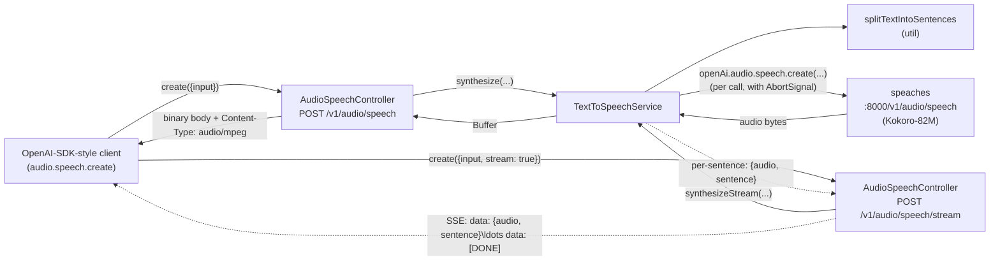
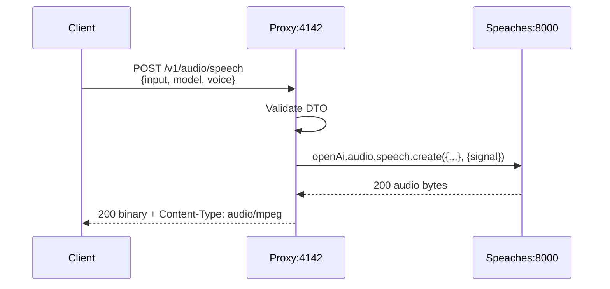
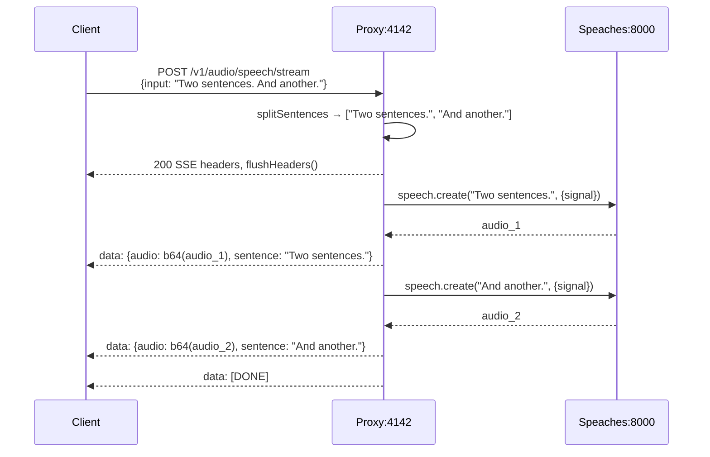
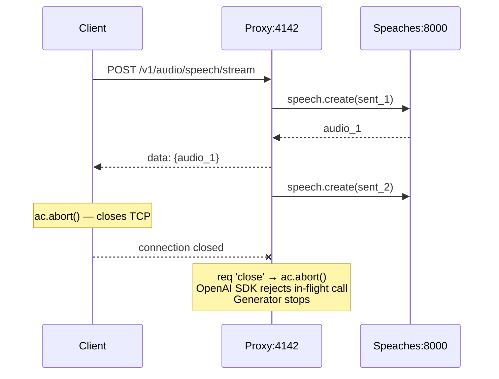

# Text-to-Speech — Technical Design Document

## Introduction

`POST /v1/audio/speech` is currently stubbed to return HTTP 501. This work replaces the stub with two real text-to-speech endpoints — **sync** (one-shot binary audio) and **streaming** (sentence-chunked SSE) — both forwarding to the local **speaches** service (Kokoro-82M backend). The shape mirrors the recently-shipped speech-to-text implementation (`audioTranscriptions.controller` → `speechToText.service` → speaches), and the streaming path mirrors the chat-completions `stream: true` overload pattern already used in `client/index.ts`.

Both endpoints are exposed in the proxy's TypeScript client (`client/index.ts`) — consumers copy this client into their apps, so it must offer the full surface (sync + streaming) with idiomatic OpenAI-SDK-style ergonomics.

## Goals and Non-Goals

### Goals
- **Sync:** `POST /v1/audio/speech` returns a binary audio body (default `audio/mpeg`).
- **Streaming:** `POST /v1/audio/speech/stream` returns an SSE stream of `{audio, sentence}` events, one per sentence, terminating with `[DONE]`.
- Both endpoints accept the same JSON body: `{ input, model?, voice?, response_format?, speed? }`.
- Defaults match the legacy ai-service: `model=hexgrad/Kokoro-82M`, `voice=af_sky`, `response_format=mp3`, `speed=1`.
- Generated TS client (`client/index.ts`) exposes `audio.speech.create()` with overloads — no `stream` flag returns `ArrayBuffer`; `stream: true` returns `AsyncIterable<SpeechChunk>`.
- Cancellation works via the HTTP request lifecycle: when the client aborts/disconnects, the server aborts the in-flight speaches call and stops processing further sentences.
- Integration tests cover both paths plus a TTS→STT round-trip that proves the audio is intelligible.

### Non-Goals
- Per-member cancel registry / separate `stopTextToSpeech` endpoint. The legacy ai-service tracked active processes by `memberId`; the proxy has no auth/member concept and uses the request lifecycle (`req.on('close')` + `AbortController`) instead. Strictly simpler and equally effective.
- Markdown-to-plaintext preprocessing (`markdownToPlainText`). Caller's responsibility.
- Voice catalog or model discovery endpoints.
- GET-based EventSource compatibility — streaming is POST + SSE (matches our existing chat-completions streaming pattern; consumers read the SSE body via `fetch`).

## Problem Statement

The proxy currently exposes `AudioSpeechController` as a stub:

```ts
@Post('speech')
speak() { return this.stub.audioSpeech(); }   // throws 501
```

Consumers using the proxy's client can transcribe audio but cannot synthesize it. Speaches running on `localhost:8000` already provides OpenAI-compatible `/v1/audio/speech` via Kokoro-82M, and the working integration code is in `ai-service/backend/src/services/speechAudio.service.ts` (`textToSpeechSync` + `textToSpeechStreaming`). We need to port both flows into the proxy following the established speech-to-text shape and the chat-completions streaming idiom.

## Architectural Overview



File layout (mirrors STT):

```
src/
  controllers/audioSpeech.controller.ts   (replace stub — 2 routes)
  services/textToSpeech.service.ts        (new — sync + streaming)
  services/speaches.config.ts             (new — shared base URL)
  utils/splitSentences.ts                 (new — port of splitTextIntoSentencesV2)
  models/audioSpeech.dto.ts               (new — request DTO + SSE chunk DTO)
```

## Detailed Technical Sections

### Components and Interfaces

#### 1. DTO — `src/models/audioSpeech.dto.ts`

OpenAI's wire contract for `/v1/audio/speech`:

| Field | Type | Required | Default | Notes |
|---|---|---|---|---|
| `input` | string | yes | — | Text to synthesize. |
| `model` | string | no | `hexgrad/Kokoro-82M` | Forwarded as-is. |
| `voice` | string | no | `af_sky` | Forwarded as-is. |
| `response_format` | string | no | `mp3` | One of `mp3`, `wav`, `flac`, `opus`, `aac`, `pcm`. Speaches validates. |
| `speed` | number | no | `1` | 0.25–4.0 per OpenAI spec. Speaches validates. |

`AudioSpeechRequestDto` has `class-validator` decorators (`@IsNotEmpty` on `input`, `@IsOptional` + `@IsString`/`@IsNumber` on the rest) plus `@ApiProperty` annotations so `openapi-spec.json` regenerates correctly.

`AudioSpeechStreamChunkDto` documents the SSE event shape for the OpenAPI spec:

```ts
export class AudioSpeechStreamChunkDto {
  @ApiProperty({ description: 'Base64-encoded audio buffer for one sentence' })
  audio: string;

  @ApiProperty({ description: 'The sentence whose audio is in this chunk' })
  sentence: string;
}
```

#### 2. Sentence splitter — `src/utils/splitSentences.ts`

Direct port of `splitTextIntoSentencesV2` from `ai-service/backend/src/utils/utils.ts`. Self-contained — no other utils dependencies. Handles abbreviations (Mr., Dr., etc.), ellipses, and an optional `maxWordsPerSentence` cap (default 50).

#### 3. Service — `src/services/textToSpeech.service.ts`

```ts
@Injectable()
export class TextToSpeechService {
  private readonly openAi: OpenAI;
  constructor() {
    this.openAi = new OpenAI({ baseURL: SPEACHES_BASE_URL, apiKey: 'na' });
  }

  /**
   * Calls speaches /v1/audio/speech once and returns the audio buffer.
   * @param signal - aborts the speaches call (e.g., when the HTTP client disconnects)
   */
  async synthesize(input: string, opts: TtsOpts, signal?: AbortSignal): Promise<Buffer> { ... }

  /**
   * Splits text into sentences and yields {audio, sentence} for each.
   * Stops yielding when signal is aborted.
   */
  async *synthesizeStream(input: string, opts: TtsOpts, signal?: AbortSignal): AsyncGenerator<{ audio: Buffer; sentence: string }> {
    const sentences = splitSentences(input);
    for (const sentence of sentences) {
      if (signal?.aborted) return;
      const audio = await this.synthesize(sentence, opts, signal);
      yield { audio, sentence };
    }
  }
}
```

- Reuses `SPEACHES_BASE_URL` from `src/services/speaches.config.ts` (extracted from STT in this PR).
- The OpenAI SDK supports passing `{ signal }` as a second arg to `audio.speech.create(...)` — abort cancels the in-flight HTTP request.
- Logs duration per sentence (matches STT service style).
- Lets exceptions propagate; controller layer maps them.

`TtsOpts = { model?: string; voice?: string; responseFormat?: string; speed?: number }`. All optional with the documented defaults.

#### 4. Controller — `src/controllers/audioSpeech.controller.ts`

Two routes:

```ts
@Post('speech')
@ApiOperation({ summary: 'Generate speech audio from text via speaches (sync)' })
@ApiBody({ type: AudioSpeechRequestDto })
@ApiResponse({ status: 200, content: { 'audio/mpeg': { schema: { type: 'string', format: 'binary' } } } })
async speak(@Body() body: AudioSpeechRequestDto, @Req() req: Request, @Res() res: Response): Promise<void> {
  const ac = new AbortController();
  req.on('close', () => ac.abort());
  try {
    const buf = await this.tts.synthesize(body.input, ttsOptsFrom(body), ac.signal);
    res.setHeader('Content-Type', contentTypeFor(body.response_format ?? 'mp3'));
    res.status(200).send(buf);
  } catch (e: any) {
    if (ac.signal.aborted) return;       // client gone — nothing to write
    console.error('[AudioSpeechController] speak error:', e?.message ?? e);
    res.status(500).json({ error: { message: e?.message ?? 'Speech synthesis failed', type: 'tts_error' } });
  }
}

@Post('speech/stream')
@ApiOperation({ summary: 'Generate speech audio sentence-by-sentence over SSE' })
@ApiBody({ type: AudioSpeechRequestDto })
@ApiResponse({ status: 200, content: { 'text/event-stream': { schema: { $ref: getSchemaPath(AudioSpeechStreamChunkDto) } } } })
async speakStream(@Body() body: AudioSpeechRequestDto, @Req() req: Request, @Res() res: Response): Promise<void> {
  res.setHeader('Content-Type', 'text/event-stream');
  res.setHeader('Cache-Control', 'no-cache, no-transform');
  res.setHeader('Connection', 'keep-alive');
  res.flushHeaders();

  const ac = new AbortController();
  req.on('close', () => ac.abort());

  try {
    for await (const { audio, sentence } of this.tts.synthesizeStream(body.input, ttsOptsFrom(body), ac.signal)) {
      if (ac.signal.aborted) break;
      const payload = JSON.stringify({ audio: audio.toString('base64'), sentence });
      res.write(`data: ${payload}\n\n`);
    }
    if (!ac.signal.aborted) res.write(`data: [DONE]\n\n`);
  } catch (e: any) {
    if (!ac.signal.aborted) {
      const errPayload = JSON.stringify({ error: { message: e?.message ?? 'tts error', type: 'tts_error' } });
      res.write(`data: ${errPayload}\n\n`);
    }
  } finally {
    res.end();
  }
}
```

`contentTypeFor()` is a 6-line lookup: `mp3 → audio/mpeg`, `wav → audio/wav`, `flac → audio/flac`, `opus → audio/opus`, `aac → audio/aac`, `pcm → audio/pcm`, default `application/octet-stream`. `ttsOptsFrom(body)` projects DTO → `TtsOpts` and applies defaults.

Drop `StubForwarderService` from the controller's constructor. `audioSpeech()` on the stub becomes dead code — remove it.

#### 5. Module wiring — `src/app.module.ts`

Add `TextToSpeechService` to providers. Controller is already registered.

#### 6. Generated client — `client/index.ts`

After regenerating, the new `AudioApi` will include `speak` and `speakStream` raw methods. Wrap them under `audio.speech` matching the chat-completions overload pattern:

```ts
export type SpeechCreateParamsBase = {
  input: string;
  model?: string;
  voice?: string;
  response_format?: string;
  speed?: number;
};
export type SpeechCreateParamsNonStreaming = SpeechCreateParamsBase & { stream?: false };
export type SpeechCreateParamsStreaming    = SpeechCreateParamsBase & { stream: true };
export type SpeechChunk = { audio: ArrayBuffer; sentence: string };

class Speech {
  constructor(private readonly baseURL: string) {}

  create(params: SpeechCreateParamsStreaming, opts?: RequestOpts): Promise<AsyncIterable<SpeechChunk>>;
  create(params: SpeechCreateParamsNonStreaming, opts?: RequestOpts): Promise<ArrayBuffer>;
  async create(params: SpeechCreateParamsBase & { stream?: boolean }, opts?: RequestOpts): Promise<ArrayBuffer | AsyncIterable<SpeechChunk>> {
    const { stream, ...body } = params;
    if (stream) {
      const res = await fetch(`${this.baseURL}/v1/audio/speech/stream`, {
        method: 'POST',
        headers: { 'Content-Type': 'application/json' },
        body: JSON.stringify(body),
        signal: opts?.signal,
      });
      if (!res.ok) throw new Error(`ai-proxy ${res.status}: ${await res.text()}`);
      return sseToSpeechChunks(res, opts?.signal);
    }
    const res = await fetch(`${this.baseURL}/v1/audio/speech`, {
      method: 'POST',
      headers: { 'Content-Type': 'application/json' },
      body: JSON.stringify(body),
      signal: opts?.signal,
    });
    if (!res.ok) throw new Error(`ai-proxy ${res.status}: ${await res.text()}`);
    return res.arrayBuffer();
  }
}

class Audio {
  readonly transcriptions: Transcriptions;
  readonly speech: Speech;
  constructor(audioApi: AudioApi, baseURL: string) {
    this.transcriptions = new Transcriptions(audioApi);
    this.speech = new Speech(baseURL);
  }
}
```

`sseToSpeechChunks(res, signal)` is an async generator very similar to the existing `sseToAsyncIterable`: parse `data: ` lines, stop on `[DONE]`, decode base64 audio to `ArrayBuffer`, surface `error` payloads by throwing.

We use raw `fetch` rather than the generated `AudioApi` for streaming because the generated client returns parsed JSON and doesn't expose the SSE body — same reason chat-completions streaming uses raw `fetch`. For sync, raw `fetch` is also used (need `arrayBuffer()` rather than the generated `Blob` wrapper) — keeps both paths symmetric and easy to copy.

Consumer-facing usage (matches chat completions):

```ts
// sync
const buf = await openai.audio.speech.create({ input: 'hello world' });

// streaming
const stream = await openai.audio.speech.create({ input: 'long text…', stream: true });
for await (const { audio, sentence } of stream) {
  player.enqueue(audio, sentence);
}

// abort
const ac = new AbortController();
openai.audio.speech.create({ input: '…', stream: true }, { signal: ac.signal });
ac.abort();   // closes connection → server aborts in-flight speaches call
```

### Data Flows and Security

#### Sync happy path



#### Streaming happy path



#### Streaming abort



#### Error paths

| Failure | Source | Sync HTTP | Streaming behavior |
|---|---|---|---|
| Missing `input` | DTO validation | 400 | 400 (validation runs before SSE headers flush) |
| `speed` outside range | speaches | 500 + JSON error | If first sentence fails: 500. If mid-stream: SSE `data: {error}` then `res.end()` |
| Speaches down (ECONNREFUSED) | network | 500 | Same — `data: {error}` then end |
| Client disconnects | request lifecycle | abort silently | abort silently, no further writes |

Risks:
- **Memory** — sync holds the full buffer; streaming holds one sentence's audio at a time. Both fine for typical inputs.
- **Long inputs** — streaming naturally caps per-call token count via sentence splitting (default 50 words/sentence). The `maxWordsPerSentence` knob is exposed but uses the legacy default.
- **No auth** — consistent with the rest of the proxy. Out of scope.
- **SSE buffering proxies** — `Cache-Control: no-transform` and `flushHeaders()` mitigate; no nginx in dev/prod path so not a current concern.

## Alternatives Considered

| Option | Pros | Cons |
|---|---|---|
| **Two routes — sync + sentence-chunked SSE (chosen)** | Clean separation; matches chat-completions streaming idiom; client overload mirrors existing patterns | Two routes to document; SSE base64 has ~33% overhead vs raw bytes |
| Single route with `stream: true` flag | One URL | Response content type swings between binary and SSE based on body — confusing for proxies, harder to spec, no real upside |
| Raw HTTP chunked-transfer of audio bytes (no SSE, no sentence framing) | Lower overhead, no base64 | Loses sentence boundaries — clients can't show captions or align playback to text. Kokoro generates per-sentence anyway, so no latency benefit |
| GET-based EventSource (legacy `textToSpeechStreaming`) | Browser EventSource support | EventSource forces GET (text in URL) — fragile for long inputs and special chars. Our chat streaming already uses POST+SSE; consistency wins |
| Per-member abort registry + `stopTextToSpeech` (legacy ai-service) | Familiar to legacy codebase | Proxy has no member identity; HTTP request lifecycle achieves the same goal with one less concept |
| Keep markdown-to-plaintext preprocessing | Caller convenience | Markdown handling is app-specific; better at the caller |

## Testing Strategy

Integration tests only (per project convention). Add `tests/integration/textToSpeech.integration.spec.ts`. Tests run against dev server on `:4142` with speaches on `:8000`, same as STT.

### Sync

#### TTS1 — basic sync synthesis
```
Given: input = "Hello, this is a test."
When:  await openai.audio.speech.create({ input })
Then:  returns ArrayBuffer with byteLength > 1000
And:   first bytes are mp3 magic (ID3 0x49 0x44 0x33 or 0xFF 0xFB)
```

#### TTS2 — explicit model/voice/format/speed
```
Given: input='...', model='hexgrad/Kokoro-82M', voice='af_sky', response_format='mp3', speed=1
When:  openai.audio.speech.create({ input, model, voice, response_format, speed })
Then:  non-empty ArrayBuffer returned
```

#### TTS3 — sync round-trip TTS → STT (correctness signal)
```
Given: input = "Hello, this is a test of the national broadcasting system."
When:  buf = await openai.audio.speech.create({ input })
And:   transcribe via openai.audio.transcriptions.create({ file: blob(buf) })
Then:  normalized transcription matches normalized input (>= 80% word overlap)
```
Reuse `normalizeText` from `speechToText.integration.spec.ts` — extract to `tests/integration/_helpers.ts`.

#### TTS4 — sync error: empty input
```
Given: input = ""
When:  POST /v1/audio/speech
Then:  HTTP 400 (DTO @IsNotEmpty)
```

### Streaming

#### TTS5 — streaming yields one chunk per sentence
```
Given: input = "First sentence. Second sentence. Third sentence."
When:  for-await over openai.audio.speech.create({ input, stream: true })
Then:  exactly 3 chunks
And:   chunks[i].sentence ≈ "First sentence." | "Second sentence." | "Third sentence." (trimming permitted)
And:   each chunks[i].audio is non-empty ArrayBuffer with mp3 magic header
```

#### TTS6 — streaming round-trip per chunk
```
Given: input = "Hello world. Goodbye world."
When:  collect all audio buffers, concatenate, transcribe
Then:  normalized transcription contains "hello world" AND "goodbye world"
```
Concatenating mp3 frames is valid for Kokoro output (independent ID3 frames). If the decoder rejects concatenation, transcribe each chunk separately and assert both expected phrases appear.

#### TTS7 — streaming abort
```
Given: input = "Sentence one. Sentence two. Sentence three. Sentence four."
       AbortController ac
When:  start streaming with { signal: ac.signal }
And:   after receiving the first chunk, ac.abort()
Then:  loop exits with at most 2 chunks observed
And:   server logs show no further speaches calls (manual / log assertion)
```

#### TTS8 — streaming mid-stream error surfaces
```
Given: voice = 'not_a_real_voice'
When:  for-await over create({ input, voice, stream: true })
Then:  iteration throws an Error with message containing 'tts_error' or speaches' upstream message
```

### Manual verification

1. Start dev: `PORT=4142 npx ts-node -r tsconfig-paths/register src/main.ts &`
2. Confirm `src/openapi-spec.json` regenerated with both endpoints.
3. `npm run generate-client`.
4. `npm run test:integration -- textToSpeech` — all 8 cases pass.
5. Save sync output and play: `curl -X POST :4142/v1/audio/speech -H 'Content-Type: application/json' -d '{"input":"hello world"}' --output /tmp/out.mp3 && start /tmp/out.mp3`.
6. Watch the SSE stream live: `curl -N -X POST :4142/v1/audio/speech/stream -H 'Content-Type: application/json' -d '{"input":"One. Two. Three."}'` — three `data:` events then `[DONE]`.

## Implementation Checklist (for the follow-up todo)

1. Create `src/services/speaches.config.ts` exporting `SPEACHES_BASE_URL` (and update STT to import).
2. Create `src/utils/splitSentences.ts` (port `splitTextIntoSentencesV2`).
3. Create `src/models/audioSpeech.dto.ts` (`AudioSpeechRequestDto`, `AudioSpeechStreamChunkDto`).
4. Create `src/services/textToSpeech.service.ts` (`synthesize`, `synthesizeStream`).
5. Replace stub in `audioSpeech.controller.ts` with sync + streaming routes; wire `req.on('close')` → abort.
6. Remove `audioSpeech()` from `StubForwarderService`.
7. Register `TextToSpeechService` in `app.module.ts`.
8. Restart dev server → verify `openapi-spec.json` updated for both routes.
9. `npm run generate-client`.
10. Add `Speech` class + `sseToSpeechChunks` helper in `client/index.ts`; expose `audio.speech.create()` with overloads. Re-export `SpeechCreateParams*`, `SpeechChunk` types.
11. Extract `normalizeText` to `tests/integration/_helpers.ts`; update STT spec import.
12. Write `tests/integration/textToSpeech.integration.spec.ts` (TTS1–TTS8).
13. Run integration tests → green.
