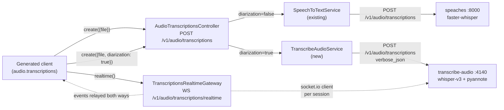
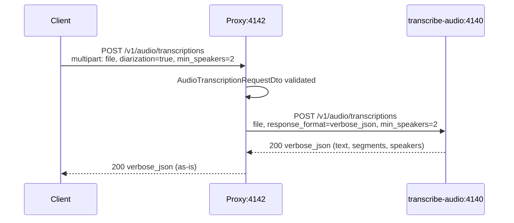
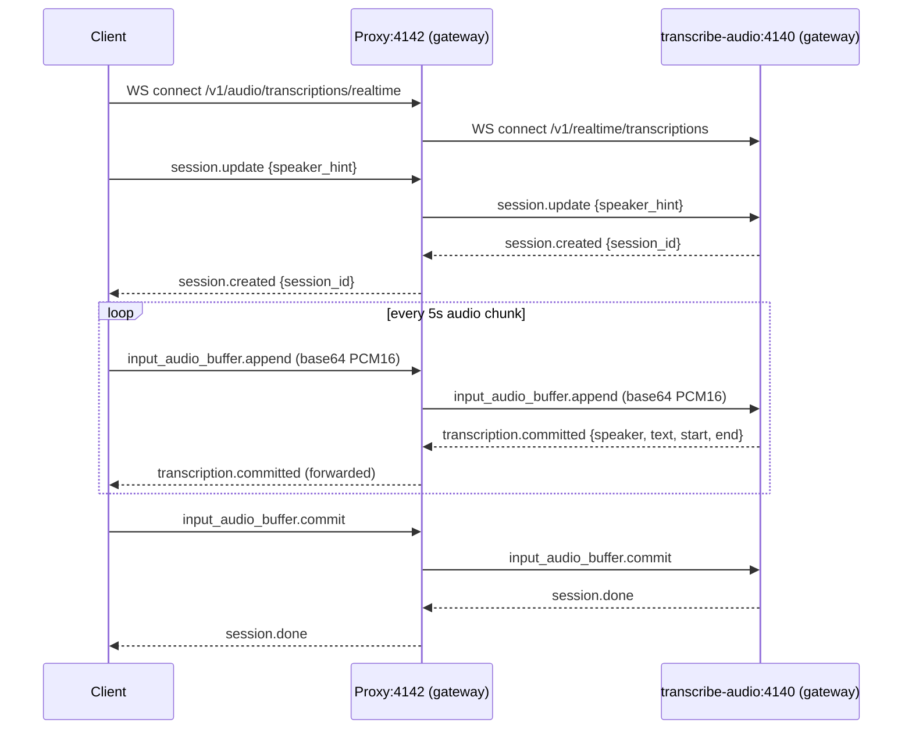
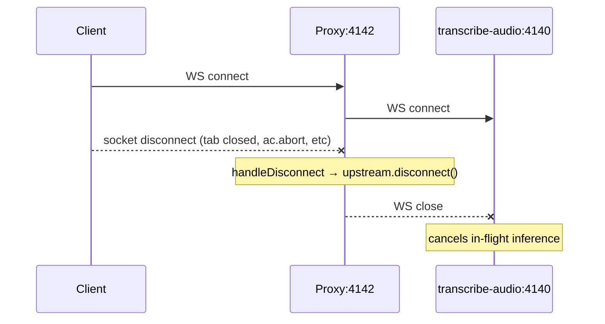

# Transcription Service (Diarization) — Technical Design Document

## Introduction

`POST /v1/audio/transcriptions` currently forwards to **speaches** (faster-whisper) and returns `{ text }`. This work adds a `diarization` flag (default `false`) that, when `true`, routes to a different upstream — the local **transcribe-audio** service on `:4140` — which runs Whisper large-v3 plus `pyannote/speaker-diarization-3.1` and returns segments labeled with speaker IDs (`SPEAKER_00`, `SPEAKER_01`, …).

Two paths are needed: **batch** (existing endpoint, new flag) and **real-time streaming** (new endpoint). The streaming path lets a client push 5-second audio chunks and receive committed segments — with speakers — as they are ready. transcribe-audio already exposes both: a multipart batch endpoint and a socket.io gateway. The proxy forwards both as-is, applying minimal request/response shaping so the public surface stays OpenAI-shaped.

## Goals and Non-Goals

### Goals
- **Batch diarization:** `POST /v1/audio/transcriptions` with `diarization: true` returns `verbose_json` containing per-segment `speaker` IDs and a `speakers` array.
- **Streaming diarization:** new WebSocket endpoint at `/v1/audio/transcriptions/realtime` (socket.io) accepts PCM16 chunks and emits `transcription.committed` events labeled with speaker.
- Speaker hints (`min_speakers`, `max_speakers`) flow through to the upstream service on both paths.
- Existing non-diarized behavior is unchanged when `diarization` is absent or `false`.
- Generated client (`client/index.ts`) exposes:
  - `audio.transcriptions.create({ file, diarization: true, min_speakers, max_speakers })` → `AudioTranscriptionVerboseResponse`.
  - `audio.transcriptions.realtime()` → returns a small session object with `sendChunk(pcm16: ArrayBuffer)`, `commit()`, `end()`, and an `AsyncIterable<TranscriptionSegment>`.
- Integration test confirms a multi-speaker fixture returns ≥ 2 distinct `SPEAKER_*` IDs (batch) and that streaming yields at least one committed segment with a speaker label.

### Non-Goals
- Replacing the speaches path. Speaches stays the default for plain `{ text }` transcription — fast and small.
- Re-implementing diarization in-proxy. transcribe-audio is the inference service; the proxy is a forwarder.
- Auth, multi-tenancy, session quotas. Proxy has none today; consistent with the rest of the surface.
- Browser-friendly EventSource / SSE for realtime. Socket.io fits the upstream protocol exactly and is what the client already needs to speak.
- Word-level timestamps, language autodetect tuning, or response_format other than `verbose_json` on the diarization batch path. The flag implies speakers, which implies verbose_json.

## Problem Statement

Today the proxy only supports a single transcription backend (speaches) that returns flat text with no speaker information. Multiple consumer features (meeting summaries, multi-speaker call review, “who said what” surfaces) need speaker-labeled segments, both as a one-shot upload and as a low-latency stream during a live call. The transcribe-audio service already provides both, but it speaks two different protocols (HTTP multipart, socket.io) on its own port. Asking consumers to talk to both ai-proxy *and* transcribe-audio directly leaks the topology, doubles the client surface, and prevents the proxy from being the single integration point.

## Architectural Overview



File layout (mirrors existing patterns):

```
src/
  controllers/
    audioTranscriptions.controller.ts          (update — add diarization flag)
    transcriptionsRealtime.gateway.ts          (new — socket.io gateway)
  services/
    transcribeAudio.service.ts                 (new — batch forwarder)
    transcribeAudio.config.ts                  (new — base URLs)
  models/
    audioTranscription.dto.ts                  (update — new fields, verbose response DTO)
```

## Detailed Technical Sections

### Components and Interfaces

#### 1. DTO — `src/models/audioTranscription.dto.ts`

Extend `AudioTranscriptionRequestDto`:

| Field | Type | Required | Default | Notes |
|---|---|---|---|---|
| `file` | binary | yes | — | unchanged |
| `model` | string | no | — | passed through |
| `language` | string | no | `en` | passed through |
| `diarization` | boolean | no | `false` | when `true`, routes to transcribe-audio |
| `min_speakers` | integer | no | — | diarization hint; ignored if `diarization=false` |
| `max_speakers` | integer | no | — | diarization hint; ignored if `diarization=false` |

New response DTO `AudioTranscriptionVerboseResponseDto` (returned only when `diarization=true`):

```ts
export class TranscriptionSegmentDto {
  @ApiProperty() id: number;
  @ApiProperty() start: number;
  @ApiProperty() end: number;
  @ApiProperty() text: string;
  @ApiProperty({ example: 'SPEAKER_00' }) speaker: string;
}

export class AudioTranscriptionVerboseResponseDto {
  @ApiProperty() task: string;            // "transcribe"
  @ApiProperty() language: string;
  @ApiProperty() duration: number;
  @ApiProperty() text: string;
  @ApiProperty({ type: [TranscriptionSegmentDto] }) segments: TranscriptionSegmentDto[];
  @ApiProperty({ example: ['SPEAKER_00', 'SPEAKER_01'] }) speakers: string[];
}
```

The existing `AudioTranscriptionResponseDto` (`{ text }`) is kept for the non-diarized path. The controller documents both with `@ApiExtraModels` + an `oneOf` schema so the generated client unions them.

#### 2. Config — `src/services/transcribeAudio.config.ts`

```ts
export const TRANSCRIBE_AUDIO_BASE_URL = process.env.TRANSCRIBE_AUDIO_BASE_URL || 'http://localhost:4140';
export const TRANSCRIBE_AUDIO_WS_URL   = process.env.TRANSCRIBE_AUDIO_WS_URL   || TRANSCRIBE_AUDIO_BASE_URL;
```

Mirrors `speaches.config.ts`. Env-driven so prod can override.

#### 3. Service — `src/services/transcribeAudio.service.ts`

Uses `fetch` + `FormData` (no OpenAI SDK; speaker hints aren't on the OpenAI shape and would be stripped). Single method for the batch path:

```ts
@Injectable()
export class TranscribeAudioService {
  /**
   * Forwards an upload to transcribe-audio with response_format=verbose_json and
   * any provided speaker hints. Returns the verbose payload as-is.
   * @param file - multer file
   * @param opts - language, min_speakers, max_speakers
   * @param signal - aborts the upstream call when the HTTP client disconnects
   */
  async transcribeWithDiarization(file: Express.Multer.File, opts: DiarizationOpts, signal?: AbortSignal): Promise<AudioTranscriptionVerboseResponseDto> { ... }
}
```

- Always sends `response_format=verbose_json` (diarization implies it).
- Forwards `language`, `min_speakers`, `max_speakers` when provided.
- Throws on non-2xx with the upstream body in the message.
- Logs duration like the existing STT service.

#### 4. Controller — `src/controllers/audioTranscriptions.controller.ts`

```ts
async transcribe(@UploadedFile() file, @Body() body: AudioTranscriptionRequestDto, @Req() req, @Res() res) {
  const ac = new AbortController();
  req.on('close', () => ac.abort());
  try {
    if (body.diarization) {
      const verbose = await this.diarization.transcribeWithDiarization(file, {
        language: body.language,
        min_speakers: body.min_speakers,
        max_speakers: body.max_speakers,
      }, ac.signal);
      res.status(200).json(verbose);
      return;
    }
    const text = await this.speechToText.transcribe(file, body.model, body.language);
    res.status(200).json({ text });
  } catch (e: any) {
    if (ac.signal.aborted) return;
    res.status(500).json({ error: { message: e?.message ?? 'Transcription failed', type: 'transcription_error' } });
  }
}
```

Swagger annotation uses `oneOf: [AudioTranscriptionResponseDto, AudioTranscriptionVerboseResponseDto]` so the generated client produces a discriminated return. Diarization defaults to `false` — existing callers are byte-identical.

#### 5. Realtime gateway — `src/controllers/transcriptionsRealtime.gateway.ts`

A NestJS socket.io gateway. Pure pass-through: every client connection opens a child socket.io client to transcribe-audio, and events flow in both directions with minimal handling.

```ts
@WebSocketGateway({ path: '/v1/audio/transcriptions/realtime', cors: true })
export class TranscriptionsRealtimeGateway implements OnGatewayConnection, OnGatewayDisconnect {
  private upstreams = new WeakMap<Socket, ClientSocket>();

  handleConnection(client: Socket) {
    const upstream = ioClient(TRANSCRIBE_AUDIO_WS_URL, {
      path: '/v1/realtime/transcriptions',
      transports: ['websocket'],
    });
    this.upstreams.set(client, upstream);

    // Upstream → client
    const events = ['session.created', 'transcription.committed', 'transcription.speaker_remapped', 'session.done', 'error'];
    events.forEach((ev) => upstream.on(ev, (payload) => client.emit(ev, payload)));

    // Client → upstream
    client.on('session.update',            (p) => upstream.emit('session.update', p));
    client.on('input_audio_buffer.append', (p) => upstream.emit('input_audio_buffer.append', p));
    client.on('input_audio_buffer.commit', ()  => upstream.emit('input_audio_buffer.commit'));
    client.on('session.end',               ()  => upstream.emit('session.end'));
  }

  handleDisconnect(client: Socket) {
    const upstream = this.upstreams.get(client);
    upstream?.disconnect();
    this.upstreams.delete(client);
  }
}
```

Event names match transcribe-audio's protocol verbatim so the proxy is transparent to the client. No buffering, no transformation, no parsing — fewest moving parts.

#### 6. Module wiring — `src/app.module.ts`

Add provider `TranscribeAudioService` and gateway `TranscriptionsRealtimeGateway`. Install `@nestjs/websockets`, `@nestjs/platform-socket.io`, `socket.io`, `socket.io-client` (one-time `npm install`).

#### 7. Generated client — `client/index.ts`

After regenerating, extend `Transcriptions`:

```ts
class Transcriptions {
  constructor(private readonly audioApi: AudioApi, private readonly baseURL: string) {}

  // existing
  async create(params: TranscriptionCreateParams): Promise<AudioTranscriptionResponse>;
  // overload — diarization branch
  async create(params: TranscriptionCreateParams & { diarization: true; min_speakers?: number; max_speakers?: number }): Promise<AudioTranscriptionVerboseResponse>;
  async create(params: any): Promise<any> {
    return this.audioApi.transcribe(
      params.file,
      params.model,
      params.language,
      params.diarization,
      params.min_speakers,
      params.max_speakers,
    );
  }

  /** Opens a socket.io session for real-time diarized transcription. */
  realtime(opts?: { speakerHint?: { min: number; max: number } }): RealtimeSession { ... }
}
```

`RealtimeSession` is a thin wrapper around a `socket.io-client` socket that exposes:

```ts
class RealtimeSession {
  sendChunk(pcm16: ArrayBuffer): void;          // emit input_audio_buffer.append (base64-encodes for caller)
  commit(): void;                                // emit input_audio_buffer.commit
  end(): void;                                   // disconnect
  segments(): AsyncIterable<TranscriptionSegment>;  // yields each committed segment
  onSpeakerRemap(cb: (from: string, to: string) => void): void;
}
```

`segments()` resolves a single iterator over the lifetime of the session, ending on `session.done` or `error`. The library `socket.io-client` is added as a client dep (already transitively shipped).

### Data Flows and Security

#### Batch — diarization=true



#### Streaming happy path



#### Disconnect



#### Error paths

| Failure | Source | Batch HTTP | Streaming behavior |
|---|---|---|---|
| Missing `file` | DTO validation | 400 | n/a |
| `diarization=true` and transcribe-audio down | network | 500 + JSON error | gateway emits `error { code: 'upstream_unavailable' }` and disconnects |
| GPU OOM / inference error | transcribe-audio | 500 with upstream body | gateway forwards `error` event verbatim |
| Client disconnects mid-batch | request lifecycle | abort silently, do not write to closed response | `handleDisconnect` closes upstream |
| Client emits malformed audio | transcribe-audio | n/a | upstream `error` event forwarded as-is |

Risks:
- **Topology coupling** — proxy now depends on a second upstream (`:4140`). Health check should be updated to surface its status; not in scope for this PR but flagged.
- **Resource pressure** — every realtime client holds one socket.io connection upstream. transcribe-audio is the bottleneck (single GPU); proxy is fine. No connection cap added — out of scope.
- **Audio format mismatch** — client must send PCM16 mono 16 kHz; the proxy does no decoding. README excerpt in the client docs flags this.
- **Auth** — none on either side. Consistent with the rest of the surface, out of scope.

## Alternatives Considered

| Option | Pros | Cons |
|---|---|---|
| **`diarization` flag + dedicated WS gateway (chosen)** | Existing endpoint stays byte-compatible; streaming mirrors upstream exactly; minimum new surface | Adds a websocket dependency to the proxy |
| Separate `/v1/audio/transcriptions/diarized` HTTP endpoint | No DTO branching; cleaner Swagger | Forces client to call a different method for the same conceptual operation; duplicates auth/quota concerns later |
| Replace speaches with transcribe-audio for all transcription | Single backend | transcribe-audio is heavier (loads whisper-v3 + pyannote); breaks every existing caller that just wants `{ text }`; slower per-call |
| SSE for streaming (per chunk POST) | Matches TTS streaming idiom | Misaligned with the upstream protocol — would require the gateway to manage a session id keyed by chunk POSTs, reinventing socket.io |
| In-proxy diarization (call pyannote directly) | Removes second service | Duplicates GPU work; pyannote needs Python + HF auth; not the proxy's job |
| Add diarization to speaches | One backend | speaches doesn't support pyannote; would require us to fork/extend it; rejected up front |

## Testing Strategy

Integration tests only. Add `tests/integration/transcribeAudioDiarization.integration.spec.ts`. Requires proxy on `:4142` and transcribe-audio on `:4140`. A two-speaker audio fixture is added at `tests/fixtures/diarization-two-speakers.wav` (a 10–20s clip with at least two speakers — can be recorded ad-hoc and committed; if size is a concern, fixture generation script can synthesize one using two TTS voices).

### Batch

#### DIA1 — diarization=false is unchanged
```
Given: existing fixture speech-to-text-test-file.m4a
When:  openai.audio.transcriptions.create({ file })
Then:  result is { text: <non-empty string> }
And:   result.segments is undefined
```

#### DIA2 — diarization=true returns verbose payload with speakers
```
Given: fixture diarization-two-speakers.wav
When:  openai.audio.transcriptions.create({ file, diarization: true, min_speakers: 2, max_speakers: 3 })
Then:  result.text non-empty
And:   result.segments.length >= 2
And:   every segment has a `speaker` matching /^SPEAKER_\d+$/
And:   result.speakers.length >= 2
```

#### DIA3 — diarization=true falls through on upstream failure
```
Given: TRANSCRIBE_AUDIO_BASE_URL pointed at a closed port via env override
When:  POST /v1/audio/transcriptions with diarization=true
Then:  HTTP 500 with body.error.type === 'transcription_error'
And:   error message mentions ECONNREFUSED or the upstream URL
```

### Streaming

#### DIA4 — realtime session yields at least one committed segment with speaker
```
Given: PCM16-decoded diarization-two-speakers.wav (use ffmpeg helper from transcribe-audio README)
When:  session = openai.audio.transcriptions.realtime({ speakerHint: { min: 2, max: 3 } })
       for each 5s chunk: session.sendChunk(chunk)
       session.commit()
Then:  at least one transcription.committed segment is observed
And:   each observed segment has speaker matching /^SPEAKER_\d+$/
And:   session.done resolves the iterator
```

#### DIA5 — disconnect tears down upstream
```
Given: an open realtime session mid-stream
When:  session.end() (or socket close)
Then:  no further events are received
And:   the proxy logs a handleDisconnect for that socket id
```
(Asserting log lines is OK here — same pattern used elsewhere; alternatively assert that a follow-up `sendChunk` is rejected.)

### Manual verification

1. Start transcribe-audio at `:4140` (per its README).
2. Start proxy: `PORT=4142 npx ts-node -r tsconfig-paths/register src/main.ts &`.
3. Confirm `src/openapi-spec.json` regenerated with the new fields and oneOf response.
4. `npm run generate-client`.
5. `npm run test:integration -- transcribeAudioDiarization` — all 5 cases pass.
6. Smoke the realtime path against a microphone capture (manual): connect via the client, speak two voices, observe `SPEAKER_00` and `SPEAKER_01` in segments.

## Implementation Checklist (for the follow-up todo)

1. `npm install @nestjs/websockets @nestjs/platform-socket.io socket.io socket.io-client`.
2. Create `src/services/transcribeAudio.config.ts`.
3. Extend `src/models/audioTranscription.dto.ts` (`diarization`, `min_speakers`, `max_speakers`, `AudioTranscriptionVerboseResponseDto`, `TranscriptionSegmentDto`).
4. Create `src/services/transcribeAudio.service.ts` (`transcribeWithDiarization`).
5. Update `src/controllers/audioTranscriptions.controller.ts` to branch on `diarization`, wire `req.on('close')` → abort, update Swagger to `oneOf`.
6. Create `src/controllers/transcriptionsRealtime.gateway.ts` (socket.io pass-through).
7. Bootstrap socket.io adapter in `src/main.ts` if needed (NestJS default `IoAdapter`).
8. Register service + gateway in `src/app.module.ts`.
9. Restart dev → verify `openapi-spec.json` updated; ws endpoint logged on boot.
10. `npm run generate-client`.
11. Extend `client/index.ts`: `Transcriptions.create` overload, `Transcriptions.realtime`, `RealtimeSession` class, export types.
12. Add fixture `tests/fixtures/diarization-two-speakers.wav` (committed or generated).
13. Write `tests/integration/transcribeAudioDiarization.integration.spec.ts` (DIA1–DIA5).
14. Run integration tests → green.
