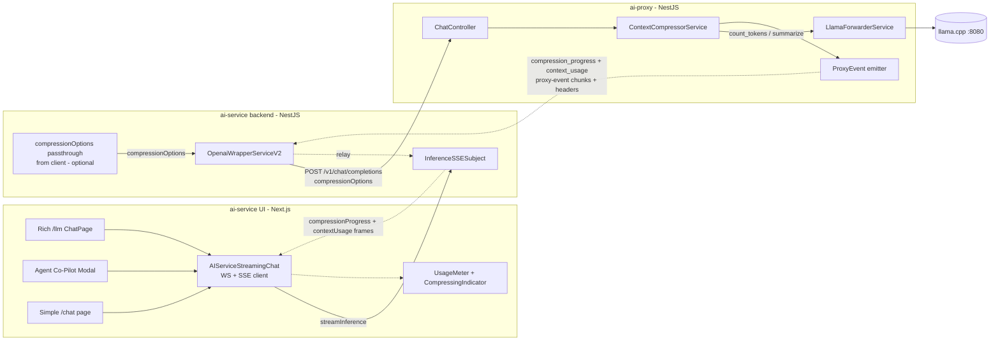
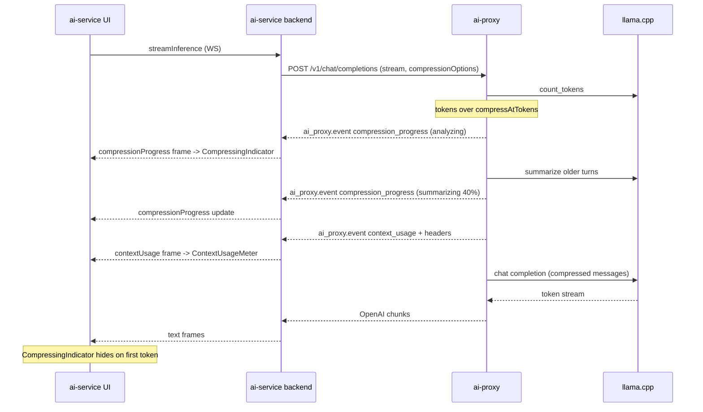
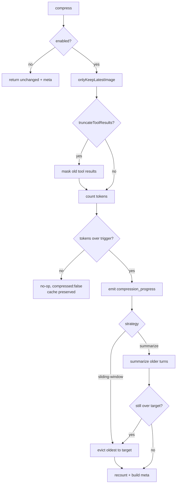

# TDD: Client-Configurable Conversation Compression (ai-proxy ⇄ ai-service)

**Status:** Draft
**Author:** Jason (via Claude)
**Date:** 2026-07-10
**Spans:** `ai-proxy` (compression engine + progress/metadata protocol) · `ai-service/backend` (offload local logic, send settings, relay events) · `ai-service/ui` (status + context-usage components) · cross-project E2E

---

## Introduction

The proxy already ships client-configurable compression (`compressionOptions` → `ContextCompressorService` → real `count_tokens`), but with only two knobs (`enabled`, `maxContextSize`) and one lossy strategy (front-eviction), where the single number is both trigger and target. Meanwhile **`ai-service` runs its own, duplicate compression** in at least two places (`utils.ts trimMessagesToContextBudget`/`keepOnlyLastImage` for the main chat flow; `aiDesigner/contextCompressor.ts compressMessages` for the designer/notebook agents). This is redundant, drifts from the proxy's real tokenizer, and is invisible to the user — long summarizations "just hang."

This TDD does three things: (1) grows the proxy's compression into a small menu of researched strategies keyed off a `compressAtTokens` threshold; (2) **removes compression logic from `ai-service`**, which instead sends the *settings* it wants (one-image-only, tool-result truncation, strategy, thresholds) to the proxy; (3) adds a **proxy→client feedback channel** so compression/summarization emits live progress (Claude-style) and every response carries **context-length metadata** (tokens used, % of context window, % remaining until the next compression). The `ai-service` chat page, the Agent Co-Pilot modal, and the simple `/chat` page render these as sleek status indicators and a context-usage meter. The whole thing is validated with cross-project E2E and a compression-quality scenario suite.

---

## Goals and Non-Goals

### Goals (measurable)

**Proxy — compression engine**
- **G1** — `compressAtTokens` (trigger) + `targetTokens` (target), separating *when* from *how far*. `compressAtTokens: 100000` with no compression below it is the headline case.
- **G2** — `strategy`: `sliding-window` (default, recency eviction) and `summarize` (running summary of older turns).
- **G3** — Opt-in tool-result truncation ("observation masking") and one-image-only, all driven by client settings.
- **G4** — Recency buffer (`keepRecentMessages`/`keepRecentTokens`) + guaranteed system-prompt preservation.
- **G5** — No-op at/below trigger (cache-safe); 100% backward-compat for `{ enabled, maxContextSize }`.

**Proxy — feedback channel**
- **G6** — Streaming responses emit `compression_progress` events during compression/summarization (phase + human message), before model tokens.
- **G7** — Every response (stream and non-stream) exposes **context-usage metadata**: `inputTokens`, `contextLimit`, `usedPct`, `compressAtTokens`, `tokensUntilCompression`, `untilCompressionPct`, `compressed`, `strategy`, and counts (dropped/summarized/truncated). Delivered as a stream event **and** response headers **and** a non-stream body field.

**ai-service backend**
- **G8** — Remove local compression: `trimMessagesToContextBudget`, `keepOnlyLastImage`, `estimateMessageTokens` (utils), `compressMessages`/`estimateMessageTokens` (aiDesigner), and their call sites. Behavior is identical or better, now driven by the proxy.
- **G9** — Forward client-supplied `compressionOptions` (all optional, no DB/`Model` storage) onto the proxy chat call, mirroring the existing `chat_template_kwargs` body spread. When the client sends nothing, no `compressionOptions` is sent and the proxy no-ops.
- **G10** — Relay proxy `compression_progress` + `contextUsage` events to the UI via new `InferenceSSESubject` frames (WS + SSE), without breaking the OpenAI-SDK stream loop.

**ai-service UI**
- **G11** — A "compressing/summarizing…" status indicator appears in the rich `/llm` chat, the Agent Co-Pilot modal, and the simple `/chat` page while compression runs.
- **G12** — A context-usage meter (tokens + % used, % until next compression) is visible in all three surfaces, turning "hot" as it approaches the threshold, reusing the existing `UsageMeters`/`ProgressBar` styling.

**Quality/testing**
- **G13** — Cross-project E2E (llama.cpp + ai-proxy + ai-service) drives long conversations and asserts compression fires, events arrive, UI updates (Playwright).
- **G14** — Compression-quality scenario suite proves output ≤ target, system/recency preserved, and (for `summarize`) that answers depending on compressed content remain correct via QA probes.

### Non-Goals
- **NG1** — RAG/vector retrieval of past turns (stateless proxy; retrieval blind spot). *Deferred.*
- **NG2** — LLMLingua/token-pruning (needs an auxiliary LM; 20× is cherry-picked, real dialogue gains 3–10×; extractive ≥ pruning). *Deferred.*
- **NG3** — Persistent cross-conversation memory / durable-facts store.
- **NG4** — Routing the aiDesigner/notebook agents (currently hitting llama.cpp `:8080` directly) through the proxy is **Phase 2** (see Rollout); v1 offloads the main chat flow.
- **NG5** — Changing model/provider or message format (llama.cpp + OpenAI Chat Completions only).

---

## Problem Statement

**Current state — proxy.** `ContextCompressorService.compress()` runs image-dedup and, if `maxContextSize` is set, `history.shift()`s from the front until under budget (tool-pair-guarded). `maxContextSize` is both trigger and target; deletion is the only strategy; the client learns nothing about what happened.

**Current state — ai-service.** Two independent compressors:
- `backend/src/utils/utils.ts`: `trimMessagesToContextBudget` (default `LLM_CONTEXT_TOKEN_BUDGET=60000`, keeps system + first user + recent, avoids orphan tool results) → `keepOnlyLastImage`; applied on **every** LLM call at `openAiWrapperV2.service.ts:56` (non-stream) and `:131` (stream), including every recursive tool round.
- `backend/src/services/aiDesigner/contextCompressor.ts`: `compressMessages` keeps only the latest screenshot and latest HTML snapshot; called each loop in `UIDesignerAgent.ts:97` and `NotebookAgent.ts:118` (these use llama.cpp `:8080` directly).

**Pain points.**
1. **Duplicated, drifting logic.** Two token estimators (chars/3.5 and chars/4) in ai-service plus the proxy's real `count_tokens` — three different truths.
2. **Trigger == target** (both proxy and the ai-service 60k budget): aggressive per-call trimming with no soft cap.
3. **Lossy-by-deletion only**; no summarization; no explicit recency contract.
4. **Invisible & silent.** Summarization can take seconds; the user sees a hang. No context-usage feedback at a 200k window where users want to *see* how full they are.
5. **Cache-blind.** Rewriting old turns invalidates the cached prefix; compressing every call can cost more than it saves.

**Impact.** Compression decisions are scattered across two repos and three estimators, users get no visibility, and there's no lever to trade cost/quality per conversation.

---

## Architectural Overview



**Two directions of new data:** settings flow **down** (UI → backend `Model` settings → `compressionOptions` → proxy); progress + context-usage flow **up** (proxy events → backend relay → UI meters). The proxy remains the single source of truth for tokenization and compression.

---

## Part A — ai-proxy: Compression Engine

### A.1 `CompressionOptionsDto` (extend — `src/models/compressionOptions.dto.ts`)

Follows the file's existing `@IsOptional()` + `class-validator` pattern; nested DTOs mirror `ChatCompletionRequestDto`'s `@ValidateNested()`+`@Type()`.

```ts
export type CompressionStrategy = 'sliding-window' | 'summarize';

export class ToolResultTruncationDto {
  @ApiPropertyOptional() @IsOptional() @IsBoolean() enabled?: boolean;
  @ApiPropertyOptional({ example: 512 }) @IsOptional() @IsNumber() @Min(1) maxToolResultTokens?: number;
  @ApiPropertyOptional({ example: 3 })   @IsOptional() @IsNumber() @Min(0) keepRecentToolResults?: number;
}
export class SummarizeOptionsDto {
  @ApiPropertyOptional() @IsOptional() @IsString() summaryModel?: string;
  @ApiPropertyOptional({ example: 1024 }) @IsOptional() @IsNumber() @Min(1) summaryMaxTokens?: number;
}
export class CompressionOptionsDto {
  @ApiPropertyOptional() @IsOptional() @IsBoolean() enabled?: boolean;

  // legacy — when set alone acts as trigger AND target (unchanged behavior)
  @ApiPropertyOptional() @IsOptional() @IsNumber() @Min(1) maxContextSize?: number;

  @ApiPropertyOptional({ example: 100000 }) @IsOptional() @IsNumber() @Min(1) compressAtTokens?: number;
  @ApiPropertyOptional({ example: 75000 })  @IsOptional() @IsNumber() @Min(1) targetTokens?: number;

  @ApiPropertyOptional({ enum: ['sliding-window','summarize'] })
  @IsOptional() @IsIn(['sliding-window','summarize']) strategy?: CompressionStrategy;

  @ApiPropertyOptional({ example: 10 }) @IsOptional() @IsNumber() @Min(1) keepRecentMessages?: number;
  @ApiPropertyOptional()                @IsOptional() @IsNumber() @Min(1) keepRecentTokens?: number;
  @ApiPropertyOptional()                @IsOptional() @IsBoolean() preserveSystemPrompt?: boolean;
  @ApiPropertyOptional()                @IsOptional() @IsBoolean() onlyKeepLatestImage?: boolean; // maps old keepOnlyLastImage

  // "% of context" metric: proxy auto-detects the window from llama.cpp /props (n_ctx);
  // this optional field lets the client OVERRIDE that auto-detected value.
  @ApiPropertyOptional({ example: 200000 }) @IsOptional() @IsNumber() @Min(1) contextLimit?: number;

  @ApiPropertyOptional({ type: ToolResultTruncationDto })
  @IsOptional() @ValidateNested() @Type(() => ToolResultTruncationDto) truncateToolResults?: ToolResultTruncationDto;
  @ApiPropertyOptional({ type: SummarizeOptionsDto })
  @IsOptional() @ValidateNested() @Type(() => SummarizeOptionsDto) summarize?: SummarizeOptionsDto;
}
```

### A.2 `ContextCompressorService` (refactor — `src/services/contextCompressor.service.ts`)

`compress()` gains a `progress` callback (used on the streaming path) and returns a **`CompressionResult`** carrying the compressed messages + metadata, instead of a bare array. `compress()` stays a thin orchestrator delegating to single-purpose methods.

```ts
export interface CompressionResult {
  messages: ChatCompletionMessageParam[];
  meta: {
    rawInputTokens: number; inputTokens: number; contextLimit: number;
    usedPct: number; compressAtTokens?: number; tokensUntilCompression: number; untilCompressionPct: number;
    compressed: boolean; strategy?: CompressionStrategy;
    droppedMessages: number; summarizedMessages: number; truncatedToolResults: number;
  };
}
type ProgressFn = (p: { phase: string; message: string; pct?: number }) => void;

async compress(messages, opts, onProgress?: ProgressFn): Promise<CompressionResult> {
  // 1. always-on light passes (image dedup + optional tool-result masking)
  // 2. count tokens; if <= trigger -> compressed:false, still return meta (no-op, cache-safe)
  // 3. onProgress({phase:'analyzing'|'summarizing'|'evicting', message})
  // 4. run strategy to target; summarize falls back to eviction if still over
  // 5. recount; build meta (usedPct vs contextLimit, tokensUntilCompression vs compressAtTokens)
}
```

New/changed private methods (all ≤ ~40 lines): `resolveTrigger`, `resolveTarget` (`0.75×trigger` default), `evictOldestToTarget` (existing loop, now honoring system prefix + recency buffer), `maskOldToolResults` (middle-clip `role:'tool'` older than `keepRecentToolResults` to `maxToolResultTokens`), `summarizeOlderTurns` (split `[system][older][recent]`, summarize `older` via `forwarder.chatCompletion` **using the same loaded model** — `summarize.summaryModel` defaults to the request's model, no separate model — replace with one summary message, evict if still over), `splitRecencyBuffer`, `countOrEstimate` (wrap `countTokens` + `estimateHistoryTokens` fallback), `resolveContextLimit` (**`opts.contextLimit` override ?? cached llama.cpp `/props n_ctx` ?? `compressAtTokens`**).

Backward-compat: legacy `{enabled, maxContextSize}` ⇒ `resolveTrigger=resolveTarget=maxContextSize`, `strategy='sliding-window'`, no progress on non-stream ⇒ **byte-identical output** (verified by golden snapshot test).

### A.3 Proxy feedback channel (new — `src/services/proxyEvents.ts` + controller changes)

**The SDK constraint:** ai-service calls the proxy through the OpenAI Node SDK, which parses each SSE `data:` line as JSON and yields it. A frame with **no `choices`** passes through the SDK untouched and is simply ignored by any `chunk.choices[0]?.delta` reader. So we emit proxy metadata as **proxy-event chunks** in the same stream:

```jsonc
// compression progress (streaming only, emitted before model tokens)
{ "object": "ai_proxy.event", "type": "compression_progress",
  "data": { "phase": "summarizing", "message": "Summarizing 42 earlier messages…", "pct": 40 } }
// context usage (streaming: one frame after compression; also headers + non-stream body)
{ "object": "ai_proxy.event", "type": "context_usage",
  "data": { "inputTokens": 74210, "rawInputTokens": 128900, "contextLimit": 200000,
            "usedPct": 37.1, "compressAtTokens": 100000, "tokensUntilCompression": 25790,
            "untilCompressionPct": 25.8, "compressed": true, "strategy": "summarize",
            "droppedMessages": 0, "summarizedMessages": 42, "truncatedToolResults": 3 } }
```

**Streaming path restructure (`ChatController.handleStream`).** Today it builds params (compression inside) then pipes. New order:
1. Open the SSE response immediately (headers).
2. Run `compressor.compress(messages, opts, onProgress)` where `onProgress` writes `compression_progress` frames to the response.
3. Write one `context_usage` frame + set metadata response headers.
4. Pipe the model stream (existing `StreamBufferService`), then `data: [DONE]`.

**Non-stream path (`handleNonStream`).** No progress frames; attach metadata to the JSON body under `x_ai_proxy` and set headers:
```
x-ai-proxy-context-tokens, x-ai-proxy-context-limit, x-ai-proxy-context-used-pct,
x-ai-proxy-compress-at, x-ai-proxy-compressed, x-ai-proxy-strategy
```
(Precedent: the controller already sets `x-ai-proxy-stream-recovery`.)

`resolveContextLimit` fetches llama.cpp `/props` once and caches `n_ctx` so `usedPct` is real even when the client omits `contextLimit`.

---

## Part B — ai-service backend: Offload + Send Settings + Relay

### B.1 Remove local compression (inventory)

| File | Remove / change |
|---|---|
| `backend/src/utils/utils.ts` | Delete `trimMessagesToContextBudget` (542–568), `keepOnlyLastImage` (489–504), `estimateMessageTokens` (513–528). Keep `sanitizeToolCallArguments`/`repairDanglingToolCalls`/`compressBase64Image` (correctness/size, not context compression). |
| `backend/src/services/openAiWrapperV2.service.ts` | Replace `messages: trimMessagesToContextBudget(openAiMessages)` at **:56** and **:131** with `messages: openAiMessages` + add `compressionOptions` to the request body (B.2). |
| `backend/src/services/aiDesigner/contextCompressor.ts` | Delete `compressMessages`/`estimateMessageTokens` (Phase 2 — see NG4). Its keep-latest-**screenshot** maps to `onlyKeepLatestImage`; keep-latest-**HTML-snapshot** maps to `truncateToolResults`. |
| `UIDesignerAgent.ts:97`, `NotebookAgent.ts:118` | Remove `compressMessages(...)` calls (Phase 2, once these route through the proxy). |
| Tests | Delete/replace `keepOnlyLastImage.spec.ts`, `contextCompressor.spec.ts`; move equivalents to ai-proxy. |

### B.2 Forward client `compressionOptions` (new)

**Decision: all compression settings originate from the calling client and are optional — nothing is stored in the DB or on `Model`.** ai-service is a pure passthrough.

- Add `compressionOptions?: CompressionOptionsShape` to `ModelParams` (`models/agent/aiTypes.ts:13`), threaded via `AiFunctionContextV2` exactly like `chat_template_kwargs`.
- The client sends the options on the `streamInference` request (Part C: the UI holds them — e.g. `ChatSettingsModal` defaults + the request builder). ai-service parses them into `modelParams.compressionOptions` in `chat.service.ts` (~:244) **without adding defaults of its own** — whatever the client omits stays omitted, and the proxy applies its own defaults (`targetTokens=0.75×compressAtTokens`, `strategy='sliding-window'`, etc.).
- If the client sends no `compressionOptions`, ai-service sends none and the proxy no-ops (Part A, G5) — so the removal of the old 60k trim is a deliberate behavior change: compression is now opt-in per request, driven by the UI's default settings rather than a server constant.
- Spread into the OpenAI create body in `openAiWrapperV2.service.ts` (~:65/:140), same mechanism as the `@ts-ignore`'d `chat_template_kwargs`.
- Transport note: `streamInference` is a `GET` with query params today; `compressionOptions` is a nested object, so send it as a JSON-encoded query param (e.g. `compressionOptions={...}`) parsed in the controller, or add a small POST variant. Confirm during implementation.

### B.3 Relay proxy events to the UI (new)

- `openAiWrapperV2.service.ts` stream loop (~:150): before reading `delta.content`, detect `chunk.object === 'ai_proxy.event'` → route to `inferenceSSESubject.sendCompressionProgress(chunk.data)` or `sendContextUsage(chunk.data)`; `continue` (never treat as content).
- Non-stream (`callOpenAiUsingModelAndSubject`): read metadata from response headers via the SDK's `.withResponse()` (or `x_ai_proxy` body field) and call `sendContextUsage(...)` once.
- `models/InferenceSSESubject.ts`: add `sendCompressionProgress(data)` → `{ compressionProgress: data }` and `sendContextUsage(data)` → `{ contextUsage: data }` frames (mirrors existing `sendStatus`/`sendText`). Add `'compressing'` to `StatusUpdateTopicType` (`conversationApiModels.ts:85`) if we also want it in the status-topic tree.

---

## Part C — ai-service UI: Status + Context-Usage Components

### C.1 Streaming client (shared — `src/services/llm/AIServiceStreamingChat.ts`)

Single change covers the rich chat **and** the copilot (both use this file). In the WS `message` handler (90–142) and SSE handler (243–283), add branches:
```ts
else if (jsonData.compressionProgress) onCompressionProgress?.(jsonData.compressionProgress);
else if (jsonData.contextUsage)        onContextUsage?.(jsonData.contextUsage);
```
Extend the callback signatures (36–45 / 198–206). The simple `/chat` inline parser (`ChatPageContent.tsx` ~296) gets the same two branches separately.

### C.2 Rich `/llm` chat

- Store: add `compressionProgress` + `contextUsage` to `pageState` (`services/llm/chatPage.ts`), set via the new callbacks in the `streamInferenceWS(...)` call (275–319), mirroring `handleStatusUpdateReceived`.
- `ChatPage.tsx`: render a **`CompressingIndicator`** next to `statusTopicElsForCurrentRequest` (line 92) while `compressionProgress.phase !== 'done'`.
- `ChatHeader.tsx`: render a **`ContextUsageMeter`** (persistent) showing `usedPct` of `contextLimit` and "≈N tokens until compression".

### C.3 Agent Co-Pilot modal (`src/components/AgentChatModal.tsx`)

- Consume the new callbacks in the `streamInferenceWS(...)` wiring (299–319); local state `compressionProgress`, `contextUsage`.
- `CompressingIndicator` near the `statusTopics` block (415–419); a compact `ContextUsageMeter` in the header (393–401, beside the `busyDot`).

### C.4 Simple `/chat` (`src/app/chat/ChatPageContent.tsx`)

- Parse the two events in the inline SSE loop (~296); render `CompressingIndicator` near the typing dots (605–611) and a slim meter in the input footer (~699).

### C.5 New shared components (reuse existing styling)

| Component | Built from | Notes |
|---|---|---|
| `ContextUsageMeter` | Clone `components/claude/UsageMeters.tsx` (`Meter`) | Already a labeled % meter with a `hot` (≥85%) red state via `--grad-danger`. Show `usedPct`, tokens, and a secondary "until compression" tick at `compressAtTokens/contextLimit`. |
| `CompressingIndicator` | `llm-common/ProgressBar.tsx` + `StatusTopicEl.tsx` pattern | Pill/row: spinner + `compressionProgress.message` (+ optional `pct` bar). Reuse `Badge` for the "Compressing" label and `.busyDot` pulse. |

CSS Modules + shared tokens (`--grad-progress`, `--surface-sunken`, `--r-pill`, `--grad-danger`), matching `llm-common/`.

```
Context: ▓▓▓▓▓▓▓░░░░░░░░  74,210 / 200,000 (37%)   ⟂ compress at 100k
[⟳ Summarizing 42 earlier messages…  ▓▓▓▓░░░░ 40%]
```

---

## Data Flows and Security

### Streaming sequence (compression → progress → tokens)



### Compression decision flow (proxy)



### Prompt-cache interaction (main risk)

Cache reads ≈ 10% of base input price; invalidation is hierarchical (changing an earlier message forfeits the cached prefix onward). Baked-in mitigations: **no-op below trigger**; a **trigger→target gap** so each compression amortizes over many later turns (default `targetTokens=0.75×compressAtTokens`); stable compressed prefixes. Documentation states plainly: on a caching upstream, *not compressing and letting the cache absorb old turns* can beat compressing. Today's upstream (llama.cpp) doesn't bill cache, so this is forward-looking guidance that still justifies the no-op/threshold design.

### Error handling & safety
- **Summarization failure** → fall back to `sliding-window` eviction for that request; never fail the completion. Emit a `compression_progress {phase:'evicting', message:'Summary failed; trimming instead'}`.
- **count_tokens failure** → `estimateHistoryTokens` fallback (existing).
- **Structural integrity** → keep tool-pair guard; never delete system when `preserveSystemPrompt`; never start the window on an orphan `tool` message (LangChain `trim_messages` `start_on`/`end_on` invariants).
- **Proxy-event isolation** → `ai_proxy.event` chunks carry no `choices`; a proxy client that doesn't understand them ignores them. No secrets in metadata; no new egress beyond existing llama.cpp calls.

---

## Alternatives Considered

| Approach | Pros | Cons | Verdict |
|---|---|---|---|
| **Sliding-window recency** | Cheap, fast, no LLM call; predictable; half-built | Drops old detail; can lose later-needed facts | **Chosen default** |
| **Recursive summarization** | Preserves info condensed; strong long-dialogue evidence; reuses forwarder | Extra LLM call; can silently drop a constraint → wrong answer later; invalidates cache | **Chosen opt-in** |
| **Tool-result truncation / masking** | Highest ROI (masking beat summarization for coding agents: ~52% cheaper, +2.6% solve); no LLM call | Helps only tool-heavy history | **Chosen, composable** |
| **Metadata via response headers only** | Simplest; works stream+non-stream | Can't stream *progress* during a long summarize | **Adopted for snapshot; events for progress** |
| **Progress via a separate WS/SSE channel** | Fully decoupled | New endpoint, correlation, more moving parts; proxy has no session store | Rejected — reuse the existing stream |
| **RAG retrieval / LLMLingua / durable-facts** | Higher ceilings | Stateful infra / auxiliary LM / brittleness | **Deferred (NG1–3)** |
| **Keep compression in ai-service** | No proxy change | Duplicated logic, three tokenizers, no shared metadata; contradicts the goal | Rejected |

Precedent for the chosen shape: LangChain `summarizationMiddleware` / `trim_messages` / `ConversationSummaryBufferMemory`, LlamaIndex `ChatSummaryMemoryBuffer`, OpenAI Codex auto-compaction (~90% of window), Anthropic context editing, and the `llmtrim` proxy — all "token-threshold trigger + recency buffer + summarize/mask the rest."

---

## Testing Strategy

Favor functional/integration/E2E over unit; Playwright for UI (per project conventions). ai-proxy integration runs on **:4141**; ai-service backend dev on **:8091**; llama.cpp on **:8080**.

### 1. ai-proxy — integration (`compress()` + HTTP)
| # | Scenario | Assertion |
|---|---|---|
| P1 | Backward-compat `{enabled, maxContextSize}` over budget | Upstream messages byte-identical to current `main` (golden snapshot) |
| P2 | No-op below `compressAtTokens` | Input returned unchanged; `meta.compressed=false`; cache-safe |
| P3 | Trigger + `targetTokens` | Real `count_tokens` result ≤ target; last `keepRecentMessages` verbatim; system preserved |
| P4 | `strategy:'summarize'` | Older turns → one summary message; recency intact; ≤ target; summary references earlier facts |
| P5 | Summarize failure | Falls back to eviction; completion succeeds; ≤ target |
| P6 | `truncateToolResults` + `onlyKeepLatestImage` | Old tool contents clipped; 2 recent verbatim; only newest image kept; tool_call_ids intact |
| P7 | Streaming emits events | Response contains `compression_progress` then `context_usage` frames **before** first model token; headers set |
| P8 | Non-stream metadata | Body `x_ai_proxy.contextUsage` present; headers set; math correct (`usedPct`, `tokensUntilCompression`) |
| P9 | `contextLimit` via `/props` | With `contextLimit` omitted, `usedPct` uses llama.cpp `n_ctx` |

### 2. ai-service backend — integration
| # | Scenario | Assertion |
|---|---|---|
| B1 | Local compression removed | `trimMessagesToContextBudget`/`keepOnlyLastImage` no longer imported/called (grep + behavior: full history reaches proxy) |
| B2 | Forwards client `compressionOptions` | Proxy request body contains exactly the client-supplied options (passthrough); when client omits them, body has none |
| B3 | Relays `compression_progress` | Proxy event → `InferenceSSESubject` emits `{compressionProgress}`; not treated as content |
| B4 | Relays `context_usage` | Emits `{contextUsage}`; non-stream reads it from headers |
| B5 | No local trim | Full (untrimmed) history reaches the proxy; ai-service adds no compression defaults of its own |

### 3. Cross-project E2E (Playwright + live stack)
Spin up llama.cpp + ai-proxy(:4141) + ai-service backend(:8091) + UI. Drive each surface (rich `/llm`, Co-Pilot modal, simple `/chat`):
| # | Scenario | Assertion |
|---|---|---|
| E1 | Long conversation crosses `compressAtTokens` | `CompressingIndicator` appears with a real message, then disappears on first token; answer streams |
| E2 | Context meter | `ContextUsageMeter` shows increasing `usedPct`; turns "hot" near threshold; drops after a compression |
| E3 | Summarize retains info | Ask a question whose answer lives only in the compressed region; correct answer returned |
| E4 | Tool-heavy conversation | Tool-result truncation fires; UI shows truncated count; agent still completes |
| E5 | Copilot parity | Same indicators render in the Agent Co-Pilot modal |

### 4. Compression-quality scenario suite (validates "good enough")
Deterministic fixtures (recorded conversations): (a) long plain chat, (b) tool/agent-heavy, (c) image-heavy, (d) mixed with a critical constraint stated early. For each × strategy:
- **Ratio:** report compression ratio (raw→compressed tokens) and that output ≤ target.
- **Structure:** system + last-N present; no orphan tool messages.
- **Retention (summarize):** QA probes — N questions answerable only from the compressed region; score answers from the compressed context vs. full context (target ≥ agreed threshold, e.g. ≥90% match). Log failures as the tuning signal for `keepRecentMessages`/`summaryMaxTokens`.
- **Regression gate:** suite runs in CI against a stub/small model; ratios and QA scores tracked over time.

---

## Rollout / Phasing

1. **Phase 1 — proxy engine + protocol.** Ship `CompressionOptionsDto` + `ContextCompressorService` refactor + event/header metadata. Regenerate spec (`start:dev` writes `openapi-spec.json`) → `npm run generate-client`. Integration tests P1–P9. No client behavior change until options are sent.
2. **Phase 2 — ai-service main chat.** Remove `utils.ts` compression; send `compressionOptions`; relay events (`InferenceSSESubject`). Backend tests B1–B5.
3. **Phase 3 — UI.** Streaming-client event parsing; `ContextUsageMeter` + `CompressingIndicator` in rich chat, copilot, simple chat. E2E E1–E5.
4. **Phase 4 — aiDesigner/notebook agents (NG4).** Route through the proxy (`:8080`→proxy) and delete `aiDesigner/contextCompressor.ts`, mapping keep-latest-screenshot→`onlyKeepLatestImage` and keep-latest-HTML→`truncateToolResults`.
5. **Phase 5 — quality suite** as a standing CI gate.

Everything is behind `compressionOptions.enabled`; clients not sending options are unaffected.

---

## Decisions (resolved)

1. **Settings origin.** ✅ All compression settings come from the **calling client** and are **optional**. No DB or per-`Model` storage. ai-service forwards them verbatim; the proxy applies defaults for anything omitted. Removing the old 60k server-side trim is intentional — compression is now opt-in per request (the UI supplies its own defaults, e.g. via `ChatSettingsModal`).
2. **`contextLimit` source of truth.** ✅ Auto-detected from **llama.cpp `/props` (`n_ctx`)**, cached; the client may **override** via `compressionOptions.contextLimit`.
3. **Summarization model.** ✅ **Same loaded model** — no separate/smaller model. `summarize.summaryModel` defaults to the request's model.
4. **QA-retention gate.** ✅ **≥90%** answer-match on the quality-suite QA probes.
5. **TDD location.** ✅ Lives here (`ai-proxy/tasks/conversation-compression-tdd.md`); no mirror.

---

## Appendix: Research Basis (verified sources)

5-angle deep-research pass; 106 extracted claims, 73/75 adversarially confirmed (the 2 refutations both flagged LLMLingua's "20×/1.5-pt" as GSM8K-cherry-picked → realistic dialogue compression 3–10×).

- **Threshold + recency + summarize:** LangChain [summarizationMiddleware / short-term memory](https://docs.langchain.com/oss/javascript/langchain/short-term-memory), [`trim_messages`](https://reference.langchain.com/python/langchain-core/messages/utils/trim_messages), [`ConversationSummaryBufferMemory`](https://reference.langchain.com/python/langchain-classic/memory/summary_buffer/ConversationSummaryBufferMemory); LlamaIndex [Memory](https://developers.llamaindex.ai/python/framework/module_guides/deploying/agents/memory/), [ChatSummaryMemoryBuffer](https://developers.llamaindex.ai/python/examples/memory/chatsummarymemorybuffer/); Codex auto-compaction ([Factory.ai](https://factory.ai/news/compressing-context)).
- **Recursive summarization quality:** [arXiv:2308.15022](https://arxiv.org/abs/2308.15022) / [ScienceDirect](https://www.sciencedirect.com/science/article/abs/pii/S0925231225008653).
- **Tool-result truncation / observation masking:** [JetBrains](https://blog.jetbrains.com/research/2025/12/efficient-context-management/); [Anthropic context editing](https://www.anthropic.com/news/token-saving-updates); [llmtrim proxy](https://github.com/fkiene/llmtrim).
- **Sliding-window tradeoffs:** [ML Mastery](https://machinelearningmastery.com/context-window-management-for-long-running-agents-strategies-and-tradeoffs/); [Aurelio](https://www.aurelio.ai/learn/langchain-conversational-memory).
- **Prompt-cache interaction:** [Anthropic prompt caching](https://platform.claude.com/docs/en/build-with-claude/prompt-caching); [Managing context](https://claude.com/blog/context-management); [Don't Break the Cache (arXiv:2601.06007)](https://arxiv.org/pdf/2601.06007); [OpenAI conversation state](https://developers.openai.com/api/docs/guides/conversation-state).
- **Prompt compression (deferred):** [LongLLMLingua (arXiv:2310.06839)](https://arxiv.org/abs/2310.06839); [Characterizing Prompt Compression (arXiv:2407.08892)](https://arxiv.org/abs/2407.08892) — extractive ≥ token-pruning; [LLMLingua (MSR)](https://www.microsoft.com/en-us/research/blog/llmlingua-innovating-llm-efficiency-with-prompt-compression/).
- **Compaction risk (silent constraint loss):** [Morph](https://www.morphllm.com/compaction-vs-summarization); [OpenAI community](https://community.openai.com/t/best-practices-for-cost-efficient-high-quality-context-management-in-long-ai-chats/1373996).

---

## Key Files (both repos)

**ai-proxy** — `src/models/compressionOptions.dto.ts`, `src/services/contextCompressor.service.ts`, `src/controllers/chat.controller.ts` (stream/non-stream + headers), `src/services/llamaForwarder.service.ts` (`countTokens`, `/props`), `src/services/streamBuffer.service.ts`, new `src/services/proxyEvents.ts`.

**ai-service backend** — `src/utils/utils.ts` (remove), `src/services/openAiWrapperV2.service.ts` (send + relay), `src/services/chat.service.ts` (build options), `src/models/agent/aiTypes.ts` (`ModelParams`), `src/models/InferenceSSESubject.ts` (new frames), `src/models/api/conversationApiModels.ts` (`Model`, status types), `src/services/aiDesigner/contextCompressor.ts` (Phase 4).

**ai-service ui** — `src/services/llm/AIServiceStreamingChat.ts` (parse), `src/services/llm/chatPage.ts` (store), `src/components/llm/chat-page/ChatPage.tsx` + `ChatHeader.tsx`, `src/components/AgentChatModal.tsx`, `src/app/chat/ChatPageContent.tsx`, new `ContextUsageMeter` + `CompressingIndicator` (reuse `components/claude/UsageMeters.tsx`, `llm-common/ProgressBar.tsx`, `StatusTopicEl.tsx`).
